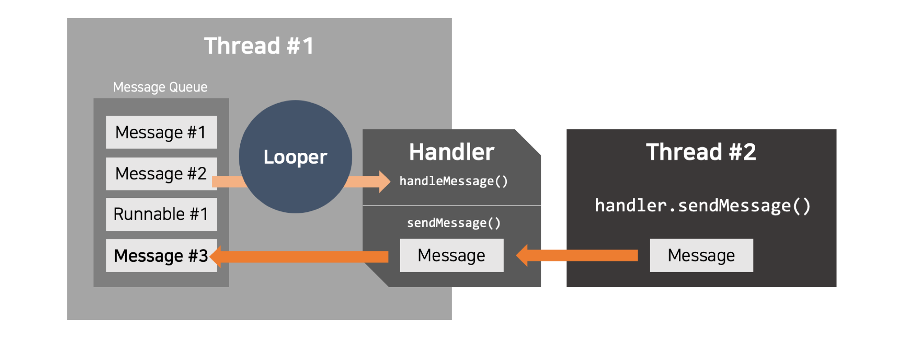

# Looper
안드로이드에서 하나의 스레드는 오직 하나의 루퍼(`Looper`)를 가질 수 있다.<br/>
메인 스레드(또는 UI 스레드)의 경우, 애플리케이션이 시작될 때 자동으로 `Looper` 가 초기화되며, 이를 통해 UI 관련 작업을 처리할 수 있다.<br/>
루퍼는 내부적으로 메시지 큐(Message Queue) 를 관리하며, 해당 스레드에서 처리해야 할 작업들을 메시지 형태로 큐에 추가하고, 이를 차례대로 꺼내어 처리하는 역할을 한다.<br/>
<br/>
<br/>

## Looper 동작 과정
특정 스레드에서 `Looper.prepare()` 를 호출하여 루퍼를 생성한다.<br/>
`Handler` 를 사용하여 `Message` 또는 `Runnable` 객체를 메시지 큐에 추가한다.<br/>
`Looper.loop()` 를 호출하면 `Handler` 가 메시지 큐에서 메시지를 하나씩 꺼내어 처리하고 실행한다.<br/>

```kotlin
class WorkerThread : Thread() {
    private lateinit var handler: Handler

    override fun run() {
        Looper.prepare() // 현재 스레드에서 Looper 준비
        handler = Handler(Looper.myLooper()!!) { message ->
            Log.d("WorkerThread", "Received: ${message.what}")
            true
        }
        Looper.loop() // 메시지 루프 실행
    }

    fun sendMessage(msg: Int) {
        handler.sendMessage(Message.obtain().apply { what = msg })
    }
}
```
```kotlin
@Test
fun `Looper_동작_확인`() {
    val workerThread = WorkerThread()
    workerThread.start()

    // WorkerThread 가 초기화될 때까지 대기
    Thread.sleep(500)

    // 메시지를 보내기
    workerThread.sendMessage(1)

    // 메시지가 처리될 시간을 기다림(테스트용)
    Thread.sleep(500)
}
```
<br/>
<br/>
<br/>


# Handler
핸들러(`Handler`)는 특정 스레드의 메시지 큐에 작업을 추가하거나, 해당 큐에서 메시지를 받아 처리하는 역할을 한다.<br/>
즉, 루퍼와 함께 작동하며 스레드 간의 통신을 중계하는 역할을 한다.<br/>
<br/><br/>
<br/>
<br/>

## Handler 역할
### 메시지 보내기
`sendMessage(Message)` 를 사용해 `Message` 객체를 메시지 큐에 추가할 수 있다.<br/>
`post(Runnable)` 를 사용해 실행 가능한 `Runnable` 객체를 메시지 큐에 추가할 수 있다.<br/>
<br/>

### 메시지 받기 및 처리
`handleMessage(Message)` 를 사용하여 메시지를 받아서 처리할 수 있다.<br/>
`Runnable.run()` 을 사용하여 큐에 추가된 실행 가능한 코드 블록을 실행할 수 있다.<br/>
<br/>

### 예제 코드
```kotlin
class ExampleHandler(looper: Looper) : Handler(looper) {
    override fun handleMessage(msg: Message) {
        when (msg.what) {
            1 -> {
                Log.d("Handler", "Message 1 received")
            }
            2 -> {
                Log.d("Handler", "Message 2 received")
            }
            else -> {
                Log.d("Handler", "Unknown message received")
            }
        }
    }
}
```
```kotlin
@Test
fun `Handler_메시지_전송`() {
    val handlerThread = HandlerThread("TestHandlerThread").apply { start() }
    val handler = ExampleHandler(handlerThread.looper)

    // 메시지를 보냄
    val message = Message.obtain().apply { what = 1 }
    handler.sendMessage(message)

    // 메시지가 처리될 시간을 기다림(테스트용)
    Thread.sleep(500)
}
```