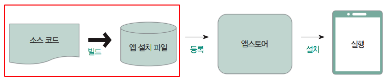
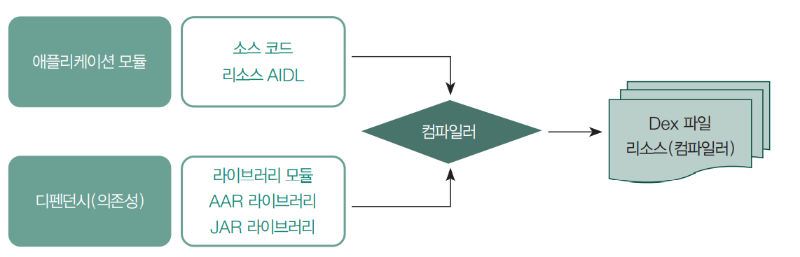
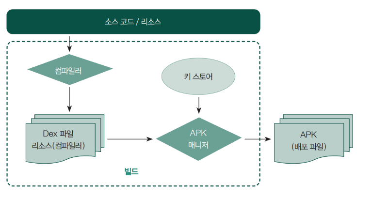

# Version
## Minimum SDK Version
앱이 실행되기 위해 필요한 최소 Android API 레벨을 나타낸다.<br/>
이 값은 앱이 지원하는 Android 버전의 하한선을 결정하며, 설정된 API 레벨보다 낮은 버전의 Android 기기에서는 앱이 작동하지 않는다.<br/>
예를 들어, `minSdkVersion` 을 21로 설정하면 Android 5.0(롤리팝) 이상의 기기에서만 앱이 실행될 수 있다.<br/>
<br/>
<br/>

## Compile SDK Version
앱을 빌드하는 동안 사용할 Android API 레벨을 나타낸다.<br/>
이는 앱이 개발 및 컴파일 단계에서 접근할 수 있는 Android 프레임워크의 버전을 의미하며, 런타임에 직접적인 영향을 주지는 않는다.<br/>
`compileSdkVersion` 을 최신 버전으로 유지하면, 최신 API 를 활용할 수 있고, 더 이상 사용되지 않는(deprecated) API 를 피할 수 있어 안정적인 앱 개발이 가능하다.<br/>
<br/>
<br/>

## Target SDK Version
앱이 목표로 하는 Android API 레벨을 나타낸다.<br/>
이 값은 앱이 특정 Android 버전의 동작 방식에 맞춰 작동하도록 최적화하는 데 사용된다.<br/>
새로운 Android 버전이 출시되면, `targetSdkVersion` 을 최신 버전으로 업데이트하여 앱이 최신 보안, 성능 개선 사항 및 시스템 동작을 따르도록 유지하는 것이 권장된다.<br/>
<br/>
<br/>

## Version Name
사용자가 앱의 버전을 확인할 때 표시되는 문자열 값으로 보통 `[MAJOR].[MINOR].[PATCH]` 형식으로 사용되며, 구글 플레이스토어에서도 `versionName` 값을 보여준다.
<br/>

### MAJOR
하위 호환성을 깨뜨리는 중요한 변경 사항이 있을 때 올린다.<br/>
주로 기존 API 의 변경이나 기능의 큰 변화를 의미한다.<br/>
<br/>

### MINOR
하위 호환성을 유지하면서 기능이 추가될 때 올린다.<br/>
주로 새로운 기능이 소개되지만, 기존 코드에 영향을 주지 않는 변경 사항이다.<br/>
<br/>

### PATCH
하위 호환성을 유지하면서 기존 기능의 버그를 수정할 때 올린다.<br/>
새로운 기능이나 API 변경 없이 오로지 버그 수정 관련 업데이트이다.<br/>
<br/>
<br/>

## Version Code
내부적으로 앱의 버전을 구분하는 정수값으로, 새로운 버전이 출시될 때마다 반드시 증가해야 한다.<br/>
구글 플레이스토어에서는 업로드된 APK/AAB 의 `versionCode` 가 기존보다 크지 않으면 업데이트를 허용하지 않는다.<br/>
<br/>
<br/>

## 예제 코드
```groovy
android {
    namespace = "com.ymg.version"
    compileSdk = 35

    defaultConfig {
        applicationId = "com.ymg.version"
        minSdk = 23
        targetSdk = 35
        versionCode = 1
        versionName = "1.0.0"

        testInstrumentationRunner = "androidx.test.runner.AndroidJUnitRunner"
    }

    buildTypes {
        release {
            isMinifyEnabled = false
            proguardFiles(
                getDefaultProguardFile("proguard-android-optimize.txt"),
                "proguard-rules.pro"
            )
        }
    }
    compileOptions {
        sourceCompatibility = JavaVersion.VERSION_11
        targetCompatibility = JavaVersion.VERSION_11
    }
    kotlinOptions {
        jvmTarget = "11"
    }
}
```
<br/>
<br/>
<br/>


# Build
안드로이드에서 빌드는 개발자가 소스 코드를 작성한 후 앱 설치 파일인 APK 또는 AAB 를 생성하는 일련의 과정을 의미한다.<br/>
이 과정에서는 코드 컴파일, 리소스 처리, 서명 등 앱 배포를 위해 필요한 여러 단계가 포함된다.<br/>
<br/><br/>
<br/>
<br/>

## Build Tool
안드로이드에서 빌드 도구는 의존성 관리, 외부 라이브러리 추가, 자동화된 설정 등을 지원하여 개발 편의성을 높일 수 있다.<br/>
안드로이드의 주된 빌드 도구는 Gradle 이며, Google 에서도 Gradle의 사용을 권장한다.<br/>
Gradle 빌드 스크립트를 통해 앱의 의존성, 라이브러리, 리소스 파일, 빌드 설정 등을 관리하고 자동화할 수 있다.<br/>
<br/>
<br/>

## Build Process
<br/><br/>
<br/><br/>
<br/>

### 컴파일 단계 
`.java` 또는 `.kt` 파일은 자바 컴파일러에 의해 `.class` 바이트코드 파일로 변환된다.<br/>
안드로이드 SDK 의 D8 또는 R8 도구를 사용하여 `.class` 파일들을 `.dex` 파일로 변환한다.<br/>
`.dex` 파일은 안드로이드 런타임에서 실행 가능한 포맷이다.<br/>
<br/>

### 리소스 패키징
안드로이드의 AAPT(Android Asset Packaging Tool) 및 Gradle 을 사용하여 이미지, 레이아웃 등의 리소스 파일과 .dex 파일, 외부 라이브러리를 APK 파일로 패키징한다.<br/>
<br/>

### 서명(Signing)
APK 파일은 디바이스에서 실행되기 위해 반드시 디지털 서명되어야 한다.<br/>
서명 과정은 빌드 과정에서 Gradle 에 설정된 키스토어 및 키 정보를 기반으로 자동으로 수행된다.<br/>
<br/>
<br/>
<br/>


# AAB(Android App Bundle)
2018년, Google은 새로운 앱 배포 형식인 AAB(Android App Bundle)를 발표했다.<br/>
기존 APK(Android Package)는 하나의 완성된 앱 파일이었으나, AAB는 다양한 모듈로 구성된 패키지 형태로, 최종 사용자의 디바이스에 최적화된 APK 를 생성하는 데 필요한 요소들로 이루어져 있다.<br/>
<br/>
<br/>

## 크기 최적화
APK 형식에서는 모든 리소스와 코드가 포함된 동일한 파일이 모든 디바이스에 설치되었다.<br/>
AAB 형식에서는 사용자 디바이스에 필요한 리소스와 코드만 포함된 APK 파일이 생성되어 설치되며, 이를 통해 앱 크기를 줄일 수 있다.<br/>
<br/>
<br/>

## 동적 기능 모듈
AAB 는 앱을 모듈 단위로 나눌 수 있어, 특정 기능이나 리소스를 사용자가 필요할 때 다운로드하는 동적 기능 모듈(DFM)을 구현할 수 있다.<br/>
<br/>
<br/>

## 크기 최적화
개발자는 AAB 파일을 Google Play 에 업로드하며, Google Play 는 이를 기반으로 사용자의 디바이스에 최적화된 APK 를 생성하여 배포한다.<br/>
<br/>
<br/>