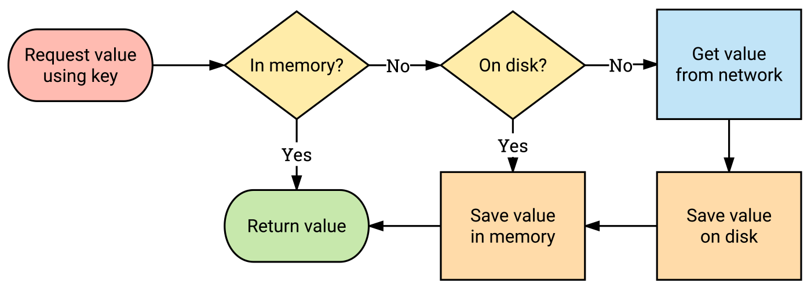

# Glide
Glide 는 Android 에서 이미지를 간편하게 로드하고 캐싱할 수 있는 라이브러리이다.<br/>
네트워크나 로컬 파일에서 이미지를 불러오는 작업을 효율적으로 처리하며, 다양한 옵션을 제공해 이미지 로드 성능을 최적화할 수 있다.<br/>
<br/>
<br/>

## Setup
```toml
# /gradle/libs/versions.toml
[versions]
glide = "4.16.0"

[libraries]
glide = { group = "com.github.bumptech.glide", name = "glide", version.ref = "glide" }
```
```groovy
// 모듈 단 build.gradle.kts
dependencies {
    implementation(libs.glide)
}
```
<br/>
<br/>

## 이미지 로드
Glide 를 사용하여 이미지를 로드하려면 `with()` 메서드에 `Context` 를 지정하고, `load()` 로 불러올 이미지의 URL 을 설정한 후, `into()` 메서드를 사용해 로드된 이미지를 적용할 `ImageView` 를 지정한다.<br/>

```kotlin
fun ImageView.bindImage(url: String) {
    Glide.with(this)
        .load(url)
        .into(this)
}
```
<br/>
<br/>

## 옵션
이미지 로딩에 다양한 옵션을 적용할 수 있는데, 이미지의 크기, 로딩 중 대체 이미지, 실패한 경우의 처리 등을 설정할 수 있다.<br/>

```kotlin
fun ImageView.bindImageWithOption(url: String) {
    Glide.with(this)
        .load(url)
        .override(100, 100) // 이미지 크기 조정
        .placeholder(android.R.drawable.menuitem_background) // 로드 전 대체 이미지
        .error(android.R.drawable.stat_notify_error) // 로드 실패 시 이미지
        .fallback(android.R.drawable.stat_notify_error) // URL 이 null 일 경우 대체 이미지
        .into(this)
}
```
<br/>
<br/>

## 이미지 요청에 대한 콜백 설정
Glide 는 이미지 요청에 대해 성공 및 실패 콜백을 제공하여 비동기 작업에 대한 처리를 도와준다.<br/>
콜백을 사용해 로드 성공 시나 실패 시의 추가 작업을 처리할 수 있다.<br/>

```kotlin
val listener = object : RequestListener<Drawable> {
    override fun onResourceReady(
        resource: Drawable,
        model: Any,
        target: com.bumptech.glide.request.target.Target<Drawable>?,
        dataSource: DataSource,
        isFirstResource: Boolean
    ): Boolean {
        // 성공 시 동작
        return false
    }

    override fun onLoadFailed(
        e: GlideException?,
        model: Any?,
        target: com.bumptech.glide.request.target.Target<Drawable>,
        isFirstResource: Boolean
    ): Boolean {
        // 실패 시 동작
        return false
    }
}
```
<br/>
<br/>

## RequestOptions 을 통한 옵션 공유
여러 `ImageView` 가 동일한 옵션으로 이미지를 로드해야 할 경우, `RequestOptions` 객체를 사용하여 옵션을 공유할 수 있다.<br/>

```kotlin
val option = RequestOptions()
    .override(100, 100)
    .placeholder(android.R.drawable.menuitem_background) // 로드 전 대체 이미지
    .error(android.R.drawable.stat_notify_error) // 로드 실패 시 이미지
    .fallback(android.R.drawable.stat_notify_error) // URL 이 null 일 경우 대체 이미지

fun ImageView.bindImageWithRequestOptions(url: String) {
    Glide.with(this)
        .load(url)
        .apply(option)
        .into(this)
}
```
<br/>
<br/>


# Image Caching
 
동일한 URL 을 반복적으로 사용하여 이미지를 로드하는 경우, 큰 이미지일 경우 매번 이미지 다운로드에 시간이 소요되고 메모리 사용량이 증가하여 성능에 악영향을 미칠 수 있다.<br/>
이를 개선하기 위해 이미지 캐싱을 사용한다.<br/>
이미지 캐싱은 URL 에서 가져온 이미지를 캐시에 저장하여 동일한 URL 요청 시 재요청 없이 캐시에 저장된 이미지를 불러오는 방식이다.<br/>
이를 통해 불필요한 네트워크 요청을 줄이고 성능을 개선할 수 있다.<br/>
<br/>
<br/>

## Glide 의 캐싱 메커니즘
Glide 는 메모리 캐시와 디스크 캐시를 사용하여 이미지를 효율적으로 캐시한다.<br/>
캐시에서 이미지를 먼저 찾고, 없으면 네트워크 요청을 통해 이미지를 불러온다.<br/>
<br/><br/>
<br/>
<br/>

## 메모리 캐싱 설정
Glide 는 기본적으로 메모리 캐싱을 수행한다.<br/>
하지만 서버에서 이미지가 업데이트되었음에도 캐싱된 이미지가 갱신되지 않는 경우가 발생할 수 있다.<br/>
이런 경우, `skipMemoryCache(true)` 를 통해 메모리 캐시를 비활성화할 수 있다.<br/>

```kotlin
fun ImageView.bindImageWithMemoryCache(url: String) {
    Glide.with(this)
        .load(url)
        .skipMemoryCache(true) // 메모리 캐싱을 비활성화하여 항상 새로운 이미지를 로드
        .into(this)
}
```
<br/>
<br/>

## 디스크 캐싱 설정
Glide 는 기본적으로 디스크 캐싱을 지원하며, 다양한 `DiskCacheStrategy` 를 제공한다.<br/>
캐싱 전략을 설정하여 디스크 캐시의 방식도 제어할 수 있다.<br/>

```kotlin
fun ImageView.bindImageWithDiskCacheStrategy(url: String) {
    // DiskCacheStrategy.ALL: 원본 이미지와 리사이즈된 이미지를 모두 캐싱한다.
    // DiskCacheStrategy.AUTOMATIC: 이미지 리소스를 분석하여 적절한 캐싱 전략을 자동으로 결정한다.
    // DiskCacheStrategy.DATA: 원본 이미지 파일만 캐싱한다.
    // DiskCacheStrategy.RESOURCE: 리사이즈된 이미지 파일만 캐싱한다.
    // DiskCacheStrategy.NONE: 디스크 캐싱을 사용하지 않는다.
    Glide.with(this)
        .load(url)
        .diskCacheStrategy(DiskCacheStrategy.ALL) // 디스크 캐시 전략을 설정
        .into(this)
}
```
<br/>
<br/>

## 캐시에서만 이미지 로드
캐시된 이미지가 존재하지 않으면 이미지를 불러오지 않도록 설정할 수도 있다.<br/>

```kotlin
fun ImageView.bindImageWithOnlyRetrieveFromCache(url: String) {
    Glide.with(this)
        .load(url)
        .onlyRetrieveFromCache(true) // 캐시에서만 이미지를 로드하고, 캐시에 없을 경우 네트워크 요청을 하지 않음
        .into(this)
}
```
<br/>
<br/>

## LRU Cache
LRU(Least Recently Used) Cache 는 제한된 캐시 크기 내에서 가장 오랫동안 사용되지 않은 항목을 제거하여 최근 사용된 데이터를 캐싱하는 방식이다.<br/>
Glide 와 같은 이미지 라이브러리들은 기본적으로 LRU 캐시를 활용하여 자주 참조되는 이미지를 메모리에 보관한다.<br/>

```kotlin
@Test
fun `LRU_Cache`() {
    // LRU Cache 객체 생성(최대 5개의 항목을 저장할 수 있음)
    val cache = LruCache<String, String>(5)

    // 항목 추가
    cache.put("A", "Item A")
    cache.put("B", "Item B")
    cache.put("C", "Item C")
    cache.put("D", "Item D")
    cache.put("E", "Item E")
    println("Cache after adding 5 items: ${cache.snapshot().keys.toList()}") // [A, B, C, D, E]

    // 캐시 크기를 초과하는 항목 추가(LRU 정책에 따라 A가 제거됨)
    cache.put("F", "Item F")
    println("Cache after adding item F: ${cache.snapshot().keys.toList()}") // [B, C, D, E, F]

    // 가장 최근에 사용된 항목을 확인하고, "C" 항목을 최근에 사용한 것처럼 설정
    cache.get("C") // "C" 를 사용하면 "C" 가 가장 최근 항목이 된다.
    println("Cache after accessing C: ${cache.snapshot().keys.toList()}") // [B, D, E, F, C]

    // 항목 추가(LRU 정책에 따라 B가 제거됨)
    cache.put("G", "Item G")
    println("Cache after adding item G: ${cache.snapshot().keys.toList()}") // [D, E, F, C, G]

    // 캐시에서 특정 항목 제거
    cache.remove("E")
    println("Cache after removing item E: ${cache.snapshot().keys.toList()}") // [D, F, C, G]

    // 캐시가 비었는지 확인
    println("Cache contains item G: ${cache.get("G") != null}")
    println("Cache contains item B: ${cache.get("B") != null}")
}
```