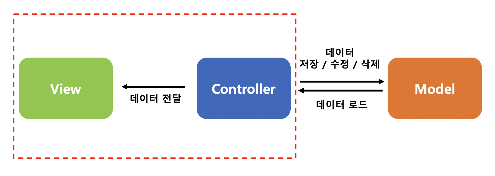

<br/><br/>
# MVC(Model-View-Controller)
MVC 패턴은 Model, View, Controller 의 약자로, 각각의 역할이 명확하게 구분되는 디자인 패턴이다.<br/>
UI 와 비즈니스 로직을 분리하여 개발의 효율성을 높이고 유지보수를 용이하게 하려는 목적을 가지고 있다.<br/>
안드로이드에서는 일반적으로 `Activity` 나 `Fragment` 가 View 역할과 동시에 Controller 역할을 수행한다.<br/>
단순성과 직관성 덕분에 빠르게 개발할 수 있게 해주지만, 코드가 점점 복잡해지고 UI 로직과 비즈니스 로직이 혼합되어 대규모 프로젝트에서는 유지보수가 어려워지는 단점이 있다.<br/>
<br/><br/>
<br/>
<br/>

## Model
데이터와 비즈니스 로직을 담당한다.<br/>
데이터를 생성, 수정, 삭제, 저장하는 책임을 가지며, 사용자 인터페이스(UI)와는 독립적으로 동작한다.<br/>

```kotlin
data class User(
    val id: Int,
    val name: String
)
```
```kotlin
class UserRepository {
    // 가상의 데이터베이스에서 사용자 데이터를 가져오는 메소드
    fun getUser(id: Int): User {
        // 실제 애플리케이션에서는 네트워크나 DB에서 데이터를 가져옵니다.
        return User(id, "John Doe")  // 예시 데이터
    }
}
```
<br/>
<br/>

## View
사용자가 보게 되는 UI 요소를 담당하며, 데이터를 어떻게 표시할지에 집중한다.<br/>
사용자에게 정보를 제공하고, 사용자로부터 입력을 받지만, 실제 데이터 처리나 로직을 담당하지 않는다.<br/>

```kotlin
class UserView(
    private val textView: TextView
) {
    // User 정보를 TextView 에 표시하는 메소드
    fun displayUserName(user: User) {
        textView.text = user.name  // TextView 에 사용자 이름을 설정
    }
}
```
<br/>
<br/>

## Controller
사용자로부터 입력된 이벤트를 받아서 처리하는 역할을 한다.<br/>
Controller 는 모델과 뷰를 연결하고, 뷰의 상태를 업데이트하거나 모델의 데이터를 변경하는 등의 작업을 한다.<br/>

```kotlin
class UserController(
    private val view: UserView, // View 는 화면 표시를 담당
    private val repository: UserRepository // Repository 는 데이터를 제공
) {
    // 사용자를 로드하여 화면에 표시하는 메소드
    fun loadUser(id: Int) {
        val user = repository.getUser(id) // Repository 에서 사용자 정보 가져오기
        view.displayUserName(user) // View 에 사용자 이름 표시
    }
}
```
<br/>
<br/>

## 예제 코드
```kotlin
class MainActivity : AppCompatActivity() {
    private lateinit var _binding: ActivityMainBinding
    private val binding get() = _binding

    private lateinit var userView: UserView
    private lateinit var userController: UserController
    private lateinit var userRepository: UserRepository

    override fun onCreate(savedInstanceState: Bundle?) {
        super.onCreate(savedInstanceState)
        enableEdgeToEdge()
        _binding = ActivityMainBinding.inflate(layoutInflater)
        setContentView(binding.root)
        ViewCompat.setOnApplyWindowInsetsListener(findViewById(R.id.main)) { v, insets ->
            val systemBars = insets.getInsets(WindowInsetsCompat.Type.systemBars())
            v.setPadding(systemBars.left, systemBars.top, systemBars.right, systemBars.bottom)
            insets
        }

        // 모델과 뷰 생성
        userRepository = UserRepository()
        userView = UserView(binding.textView)

        // 컨트롤러 생성
        userController = UserController(userView, userRepository)

        // 버튼 클릭 시 사용자 정보 로드
        binding.button.setOnClickListener {
            userController.loadUser(1)  // 사용자 ID 1번의 정보를 로드
        }
    }
}
```
```xml
<?xml version="1.0" encoding="utf-8"?>
<LinearLayout xmlns:android="http://schemas.android.com/apk/res/android"
    xmlns:tools="http://schemas.android.com/tools"
    android:id="@+id/main"
    android:layout_width="match_parent"
    android:layout_height="match_parent"
    android:orientation="vertical"
    tools:context=".MainActivity">

    <Button
        android:id="@+id/button"
        android:layout_width="wrap_content"
        android:layout_height="wrap_content"
        android:text="Load User" />

    <TextView
        android:id="@+id/textView"
        android:layout_width="wrap_content"
        android:layout_height="wrap_content"
        android:textSize="18sp"
        android:layout_marginTop="16dp" />

</LinearLayout>
```