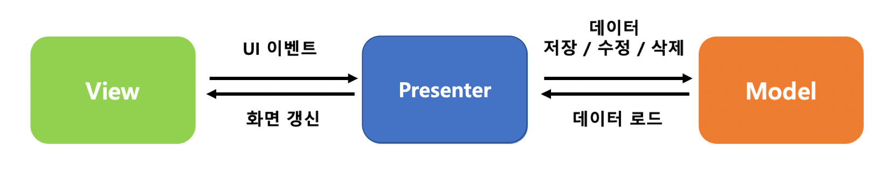

<br/>
# MVP(Model-View-Presenter)
MVP 패턴은 MVC(Model-View-Controller)의 한계를 보완하여 View 와 비즈니스 로직을 보다 명확하게 분리한 아키텍처 패턴이다.<br/>
MVP 패턴을 사용하면 UI 로직과 비즈니스 로직을 분리하여 테스트하기 용이하며, UI 와 독립적인 비즈니스 로직을 유지보수하기 쉬워진다.<br/>
하지만 View 와 1:1 관계로 많은 Presenter 가 필요하게 되므로 코드 양이 증가하고, Presenter 의 복잡성이 증가하여 유지보수가 어려워질 수 있다.<br/>
<br/>
<br/>
<br/>

## Model
데이터의 관리와 비즈니스 로직을 담당한다.<br/>
네트워크 또는 데이터베이스와의 연결을 처리하고 데이터를 가공하며, Presenter 에게 데이터를 제공한다.<br/>

```kotlin
data class User(
    val name: String,
    val age: Int
)
```
```kotlin
interface UserRepository {
    fun getUser(): User
}

class UserRepositoryImpl : UserRepository {
    override fun getUser(): User {
        return User(name = "홍길동", age = 30)
    }
}
```
<br/>
<br/>

## View
사용자에게 UI를 표시하고 입력을 받는다.<br/>
Presenter 와 인터페이스를 통해 상호작용하며, Presenter 의 요청에 따라 UI 를 업데이트한다.<br/>

```kotlin
interface UserView {
    fun showUser(user: User)
    fun showError(message: String)
}
```
<br/>
<br/>

## Presenter
View 와 Model 사이에서 중재 역할을 담당한다.<br/>
View 에서 전달받은 사용자 이벤트를 처리하고 Model 의 데이터를 조작하며, Model 에서 데이터를 받아 View 에 전달한다.<br/>
View 와 1:1 관계를 가지며, View에 의존성을 가진다.<br/>

```kotlin
class UserPresenter(
    private val view: UserView,
    private val repository: UserRepository
) {
    fun loadUser() {
        try {
            val user = repository.getUser()
            view.showUser(user)
        } catch (e: Exception) {
            view.showError("사용자 정보를 불러오는 데 실패했습니다.")
        }
    }
}
```
<br/>
<br/>

## 예제 코드
```kotlin
class MainActivity : AppCompatActivity(), UserView {
    private lateinit var _binding: ActivityMainBinding
    private val binding get() = _binding

    private lateinit var presenter: UserPresenter

    override fun onCreate(savedInstanceState: Bundle?) {
        super.onCreate(savedInstanceState)
        enableEdgeToEdge()
        _binding = ActivityMainBinding.inflate(layoutInflater)
        setContentView(binding.root)
        ViewCompat.setOnApplyWindowInsetsListener(findViewById(R.id.main)) { v, insets ->
            val systemBars = insets.getInsets(WindowInsetsCompat.Type.systemBars())
            v.setPadding(systemBars.left, systemBars.top, systemBars.right, systemBars.bottom)
            insets
        }

        presenter = UserPresenter(this, UserRepositoryImpl())
        presenter.loadUser()
    }

    @SuppressLint("SetTextI18n")
    override fun showUser(user: User) {
        binding.text.text = "이름: ${user.name}, 나이: ${user.age}"
    }

    override fun showError(message: String) {
        Toast.makeText(this, message, Toast.LENGTH_SHORT).show()
    }
}
```
```xml
<?xml version="1.0" encoding="utf-8"?>
<androidx.constraintlayout.widget.ConstraintLayout xmlns:android="http://schemas.android.com/apk/res/android"
    xmlns:app="http://schemas.android.com/apk/res-auto"
    xmlns:tools="http://schemas.android.com/tools"
    android:id="@+id/main"
    android:layout_width="match_parent"
    android:layout_height="match_parent"
    tools:context=".MainActivity">

    <TextView
        android:id="@+id/text"
        android:layout_width="wrap_content"
        android:layout_height="wrap_content"
        app:layout_constraintBottom_toBottomOf="parent"
        app:layout_constraintEnd_toEndOf="parent"
        app:layout_constraintStart_toStartOf="parent"
        app:layout_constraintTop_toTopOf="parent" />

</androidx.constraintlayout.widget.ConstraintLayout>
```