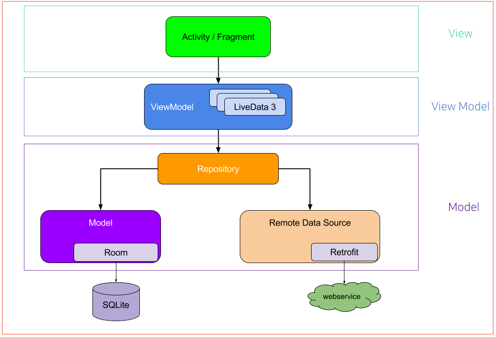

# MVVM(Model-View-ViewModel)
MVVM(Model-View-ViewModel) 패턴은 안드로이드에서 권장되는 아키텍처 패턴으로, UI 로직과 비즈니스 로직을 분리하여 유지보수성과 테스트 용이성을 높이는 데 기여한다.<br/>
MVVM 의 핵심 개념은 ViewModel 이 View 에 대한 참조를 가지지 않고 독립적으로 존재한다는 점이다.<br/>
이를 통해 액티비티 및 프래그먼트의 생명주기와 관계없이 데이터를 유지할 수 있으며, 화면 회전과 같은 구성 변경(Configuration Change) 시에도 데이터 손실을 방지할 수 있다.<br/>
또한, ViewModel 의 `onCleared()` 메서드를 활용하여 액티비티 또는 프래그먼트가 종료될 때 필요한 리소스를 해제하여 메모리 누수를 방지할 수 있다.<br/>

<br/>
<br/>

## Repository 패턴
Repository 패턴은 데이터 계층을 관리하고, 여러 데이터 소스(예: 네트워크, 로컬 데이터베이스, 캐시 등)로부터 데이터를 추상화하여 제공하는 역할을 하는 디자인 패턴이다.<br/>
Repository 는 ViewModel 에서 데이터 소스의 세부 구현을 숨기고, 데이터를 가져오는 방식에 대한 구체적인 사항을 캡슐화한다.<br/>
UI 계층에서는 Repository 를 통해 데이터를 요청하고, 데이터 소스의 선택이나 변환 등은 Repository 내부에서 처리하며, 이를 통해 ViewModel 은 주로 UI 관련 로직에 집중할 수 있게 만든다.<br/>
<br/>
<br/>

## Model
비즈니스 로직과 데이터를 담당하며, 데이터베이스, 네트워크 API, 로컬 캐시 등을 통해 데이터를 관리한다.<br/>
일반적으로 Repository 패턴을 통해 원격 또는 로컬 데이터 소스를 처리한다.<br/>

```kotlin
data class User(
    val id: Int,
    val name: String,
    val age: Int
)
```
```kotlin
class UserRepository {
    private val userList = listOf(
        User(1, "홍길동", 25),
        User(2, "이순신", 30),
        User(3, "강감찬", 35)
    )

    fun getUsers(): List<User> {
        return userList
    }
}
```
<br/>
<br/>

## View
UI 요소를 담당하며, 사용자가 볼 수 있는 화면을 구성한다.<br/>
ViewModel 의 데이터(예: `LiveData`, `StateFlow`)를 구독하고 상태 변화를 감지하고 UI 를 업데이트한다.<br/>

```kotlin
class MainActivity : AppCompatActivity() {
    private lateinit var _binding: ActivityMainBinding
    private val binding get() = _binding

    private val viewModel: MainViewModel by viewModels()

    override fun onCreate(savedInstanceState: Bundle?) {
        super.onCreate(savedInstanceState)
        enableEdgeToEdge()
        _binding = DataBindingUtil.setContentView<ActivityMainBinding>(this, R.layout.activity_main).apply {
            lifecycleOwner = this@MainActivity
            viewModel = this@MainActivity.viewModel
        }
        ViewCompat.setOnApplyWindowInsetsListener(findViewById(R.id.main)) { v, insets ->
            val systemBars = insets.getInsets(WindowInsetsCompat.Type.systemBars())
            v.setPadding(systemBars.left, systemBars.top, systemBars.right, systemBars.bottom)
            insets
        }

        viewModel.users.observe(this) {
            Toast.makeText(this, it.joinToString(), Toast.LENGTH_SHORT).show()
        }
    }
}
```
```xml
<?xml version="1.0" encoding="utf-8"?>
<layout xmlns:android="http://schemas.android.com/apk/res/android"
    xmlns:tools="http://schemas.android.com/tools"
    android:id="@+id/main"
    tools:context=".MainActivity">

    <data>
        <variable
            name="viewModel"
            type="com.ymg.mvvm.MainViewModel" />
    </data>

    <LinearLayout
        android:layout_width="match_parent"
        android:layout_height="match_parent"
        android:orientation="vertical"
        android:gravity="center">

        <Button
            android:layout_width="wrap_content"
            android:layout_height="wrap_content"
            android:text="Load Users"
            android:onClick="@{() -> viewModel.fetchUsers()}" />

    </LinearLayout>

</layout>
```
<br/>
<br/>

## ViewModel
View 와 Model 간의 중재자로 동작하며, UI 로직과 비즈니스 로직을 분리한다.<br/>
View 와 직접적인 참조 관계를 가지지 않으며, `StateFlow`, `LiveData` 와 같은 옵저버블 객체를 통해 데이터를 제공한다.<br/>

```kotlin
class MainViewModel : ViewModel() {
    private val repository = UserRepository()
    private val _users = MutableLiveData<List<User>>()
    val users: LiveData<List<User>> get() = _users

    fun fetchUsers() {
        _users.value = repository.getUsers()
    }
}
```