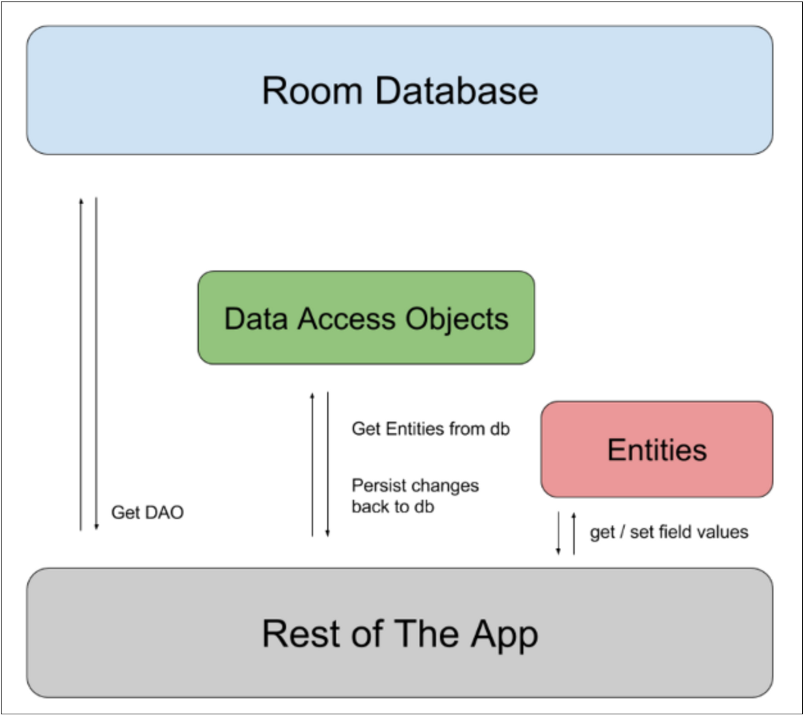

# Room
Room 은 Android 의 SQLite 데이터베이스를 보다 직관적으로 다룰 수 있도록 제공되는 ORM(Object Relational Mapping) 라이브러리이다.<br/>
Room 은 SQLite 의 복잡한 쿼리 작성을 간소화하고, 컴파일 시점에서 SQL 구문 오류를 체크하여 안정성을 높여준다.<br/>
또한 `LiveData`, `Flow` 와 같은 비동기 흐름을 지원하여 효율적인 데이터 처리를 가능하게 한다.<br/>
<br/>
<br/>
<br/>

## Setup
```toml
# /gradle/libs/versions.toml
[versions]
ksp = "2.0.20-1.0.25"
androidx-room = "2.6.1"

[plugins]
ksp = { id = "com.google.devtools.ksp", version.ref = "ksp" }

[libraries]
androidx-room = { group = "androidx.room", name = "room-ktx", version.ref = "androidx-room" }
androidx-room-compiler = { group = "androidx.room", name = "room-compiler", version.ref = "androidx-room" }
androidx-room-paging = { group = "androidx.room", name = "room-paging", version.ref = "androidx-room" }
androidx-room-runtime = { group = "androidx.room", name = "room-runtime", version.ref = "androidx-room" }
androidx-room-testing = { group = "androidx.room", name = "room-testing", version.ref = "androidx-room" }
```
```groovy
// 최상위 build.gradle.kts
plugins {
    alias(libs.plugins.ksp) apply false
}
```
```groovy
// 모듈 단 build.gradle.kts
plugins {
    alias(libs.plugins.ksp)
}
dependencies {
    implementation(libs.androidx.room)
    ksp(libs.androidx.room.compiler)
    implementation(libs.androidx.room.paging)
    implementation(libs.androidx.room.runtime)
    testImplementation(libs.androidx.room.testing)
}
```
<br/>
<br/>

## Entity
Entity 는 데이터베이스 테이블을 나타내는 데이터 모델 클래스이다.<br/>
각 Entity 는 적어도 하나의 Primary Key 를 포함해야 하며, 추가적으로 `TypeConverter` 를 활용하여 복잡한 데이터 타입을 저장할 수도 있다.<br/>
기본적으로 저장할 수 없는 데이터 타입(예: `Date`, `List`)을 저장하려면 `TypeConverter` 를 사용해야 한다.<br/>
```kotlin
/**
 * Entity 는 데이터베이스 테이블을 정의하는 클래스
 * @PrimaryKey(autoGenerate = true) 로 Primary Key 자동 생성 가능
 */
@Entity(tableName = "bookmarks")
@TypeConverters(DateConverter::class) // 필요시 TypeConverter 사용
data class BookMarkEntity(
    @PrimaryKey(autoGenerate = true)
    val id: Int = 0,

    @ColumnInfo(name = "title")
    val title: String,

    @ColumnInfo(name = "description")
    val description: String,

    @ColumnInfo(name = "created")
    val created: Date = Date() // 날짜 타입 저장 예시
)
```
```kotlin
class DateConverter {
    @TypeConverter
    fun fromTimestamp(value: Long?): Date? {
        return value?.let { Date(it) }
    }

    @TypeConverter
    fun dateToTimestamp(date: Date?): Long? {
        return date?.time
    }
}
```
<br/>
<br/>

## DAO(Database Access Object)
DAO 는 데이터베이스에 접근하여 수행할 작업을 정의하는 인터페이스이다.<br/>
Room 이 DAO 를 기반으로 자동으로 구현을 생성하며, `LiveData` 및 `Flow` 를 활용하여 비동기 데이터 처리가 가능하다.<br/>
```kotlin
/**
 * DAO 는 데이터베이스 작업을 정의하는 인터페이스
 * OnConflictStrategy 는 Primary Key 충돌 시 정책을 설정
 */
@Dao
interface BookMarkDao {
    @Query("SELECT * FROM bookmarks ORDER BY created ASC")
    suspend fun findAll(): List<BookMarkEntity> // 모든 북마크 조회

    @Insert(onConflict = OnConflictStrategy.REPLACE)
    suspend fun insert(bookMarkEntity: BookMarkEntity) // 북마크 삽입

    @Query("DELETE FROM bookmarks WHERE id = :id")
    suspend fun delete(id: Int) // 특정 북마크 삭제
}
```
<br/>
<br/>

## Database
Database 는 `RoomDatabase` 를 상속하는 추상 클래스이며, 앱의 데이터베이스를 정의하는 역할을 한다.<br/>
`@Database` 어노테이션을 사용하여 엔티티 및 버전을 지정하며, 싱글톤 패턴을 통해 인스턴스를 관리할 수 있다.<br/>
```kotlin
/**
 * 앱의 Room 데이터베이스 정의
 * exportSchema = false 로 설정하면 스키마 파일이 생성되지 않음
 */
@Database(
    entities = [BookMarkEntity::class], // 사용할 엔티티 클래스
    version = 1,
    exportSchema = false
)
abstract class AppDatabase : RoomDatabase() {

    abstract fun bookMarkDao(): BookMarkDao // DAO 정의

    companion object {
        private const val DB_NAME = "app.db"
        @Volatile
        private var INSTANCE: AppDatabase? = null

        /**
         * 싱글톤 인스턴스 제공
         * synchronized 블록을 통해 다중 스레드 환경에서 데이터베이스의 안정성 보장
         */
        fun getInstance(context: Context): AppDatabase {
            return INSTANCE ?: synchronized(this) {
                INSTANCE ?: Room.databaseBuilder(
                    context.applicationContext,
                    AppDatabase::class.java,
                    DB_NAME
                )
                    .fallbackToDestructiveMigration() // 스키마 변경 시 데이터 초기화
                    .build()
                    .also { INSTANCE = it }
            }
        }
    }
}
```
<br/>
<br/>

## 예제 코드
```kotlin
class BookMarkRepository(
    private val dao: BookMarkDao
) {
    suspend fun findALl(): List<BookMarkEntity> {
        return dao.findAll()
    }

    suspend fun insert(bookMarkEntity: BookMarkEntity) {
        dao.insert(bookMarkEntity)
    }

    suspend fun delete(id: Int) {
        dao.delete(id)
    }
}
```
```kotlin
class MainViewModel(
    application: Application
) : AndroidViewModel(application) {
    private val database = AppDatabase.getInstance(application.applicationContext)
    private val repository = BookMarkRepository(database.bookMarkDao())

    init {
        viewModelScope.launch {
            addBookmark(
                BookMarkEntity(
                    title = "Title",
                    description = "Description"
                )
            )
            getBooks()
            removeBookmark(1)
            getBooks()
        }
    }

    private fun getBooks() = viewModelScope.launch {
        println(repository.findALl())
    }

    private fun addBookmark(
        bookmark: BookMarkEntity
    ) = viewModelScope.launch {
        repository.insert(bookmark)
    }

    private fun removeBookmark(
        id: Int
    ) = viewModelScope.launch {
        repository.delete(id)
    }
}
```
```kotlin
class MainActivity : AppCompatActivity() {
    private lateinit var viewModel: MainViewModel

    override fun onCreate(savedInstanceState: Bundle?) {
        super.onCreate(savedInstanceState)
        enableEdgeToEdge()
        setContentView(R.layout.activity_main)
        ViewCompat.setOnApplyWindowInsetsListener(findViewById(R.id.main)) { v, insets ->
            val systemBars = insets.getInsets(WindowInsetsCompat.Type.systemBars())
            v.setPadding(systemBars.left, systemBars.top, systemBars.right, systemBars.bottom)
            insets
        }
        viewModel = ViewModelProvider(
            this,
            ViewModelProvider.AndroidViewModelFactory(application)
        )[MainViewModel::class.java]
    }
}
```