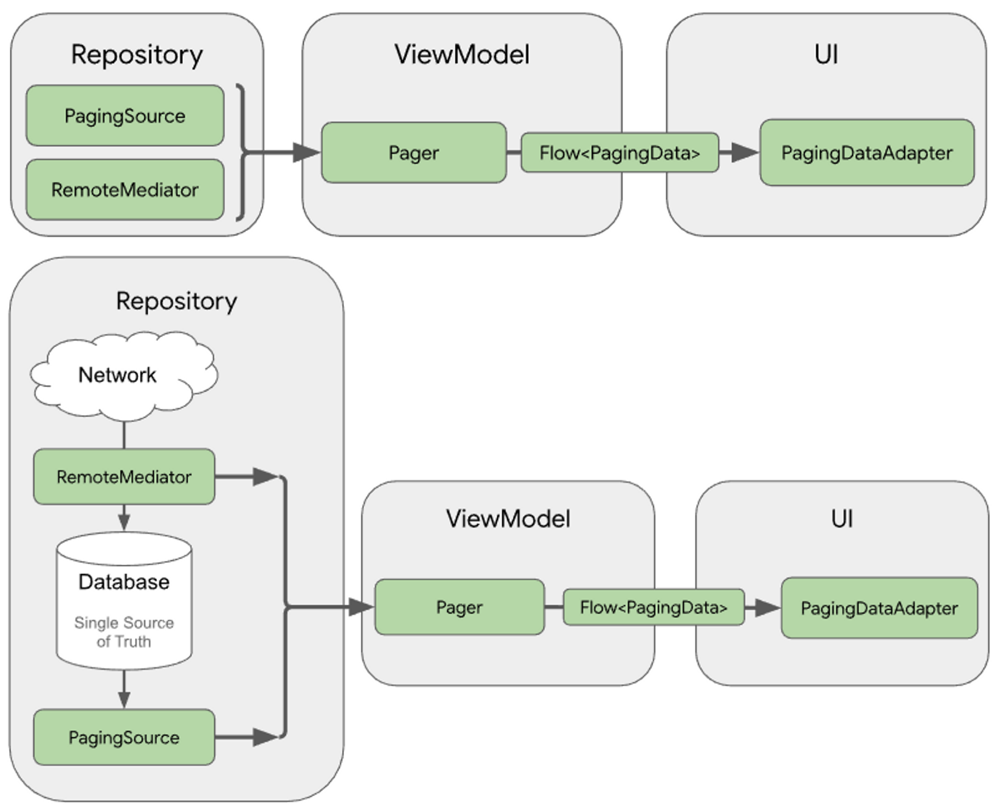

# Paging
Android 에서 지원하는 페이징 라이브러리로, 대규모 데이터를 효율적으로 로드하고 UI 에 반영할 수 있도록 설계되었다.<br/>
`PagingConfig` 와 `PagingSource` 또는 `RemoteMediator` 의 설정을 기반으로 `Pager` 를 사용해 `PagingData` 를 생성한 후, 이를 `PagingDataAdapter` 로 UI 에 반영하는 방식으로 동작한다.<br/>
<br/><br/>
<br/>
<br/>

## Paging 구성 요소
### Pager 및 PagingConfig
`Pager` 는 `PagingConfig` 와 `PagingSource` 또는 `RemoteMediator` 를 통해 `PagingData` 를 스트림 형태로 생성하는 클래스이다.<br/>
이를 통해 UI 에서 효율적으로 데이터를 소비할 수 있다.<br/>
<br/>

### PagingSource
`PagingSource` 는 데이터를 페이징 방식으로 로드하기 위한 클래스이다.<br/>
<br/>

### RemoteMediator
`RemoteMediator` 는 서버 데이터를 로드해 로컬 DB에 저장하고, 캐시된 데이터를 UI 에 제공하는 역할을 한다. <br/>
보통 Room 과 함께 사용하여 서버와 로컬 데이터베이스를 연동한다.<br/>
<br/>
<br/>

## Setup
```toml
# /gradle/libs/versions.toml
[versions]
androidx-paging = "3.3.6"
ksp = "2.0.20-1.0.25"
androidx-room = "2.6.1"

[plugins]
ksp = { id = "com.google.devtools.ksp", version.ref = "ksp" }

[libraries]
androidx-paging-runtime = { group = "androidx.paging", name = "paging-runtime", version.ref = "androidx-paging" }
androidx-room = { group = "androidx.room", name = "room-ktx", version.ref = "androidx-room" }
androidx-room-compiler = { group = "androidx.room", name = "room-compiler", version.ref = "androidx-room" }
androidx-room-paging = { group = "androidx.room", name = "room-paging", version.ref = "androidx-room" }
androidx-room-runtime = { group = "androidx.room", name = "room-runtime", version.ref = "androidx-room" }
androidx-room-testing = { group = "androidx.room", name = "room-testing", version.ref = "androidx-room" }
```
```groovy
// 최상위 build.gradle.kts
plugins {
    alias(libs.plugins.ksp) apply false
}
```
```groovy
// 모듈 단 build.gradle.kts
plugins {
    alias(libs.plugins.ksp)
}
dependencies {
    implementation(libs.androidx.paging.runtime)
    implementation(libs.androidx.room)
    ksp(libs.androidx.room.compiler)
    implementation(libs.androidx.room.paging)
    implementation(libs.androidx.room.runtime)
    testImplementation(libs.androidx.room.testing)
}
```
<br/>
<br/>

## PagingSource 사용 예제 코드
```kotlin
data class Data(
    val id: Int = 0,
    val name: String
)
```
```kotlin
class FakePagingSource : PagingSource<Int, Data>() {
    // 데이터를 가져오는 로직을 구현하는 함수
    // LoadResult.Page 를 반환해 이전 및 다음 페이지를 정의
    override suspend fun load(params: LoadParams<Int>): LoadResult<Int, Data> {
        val page = params.key ?: 1
        val data = List(20) { index ->
            Data(
                id = (page - 1) * 20 + index,
                name = "Item ${(page - 1) * 20 + index}"
            )
        }
        return LoadResult.Page(
            data = data,
            prevKey = if (page == 1) null else page - 1,
            nextKey = if (page < 5) page + 1 else null
        )
    }

    // 데이터 업데이트 시 사용하며, 현재 페이지 목록을 대체할 새 데이터를 가져올 때 호출
    // anchorPosition 을 기준으로 가까운 페이지 정보를 반환해 적절한 Key 로 새 데이터를 로드
    override fun getRefreshKey(state: PagingState<Int, Data>): Int? {
        return state.anchorPosition?.let {
            val anchorPage = state.closestPageToPosition(it)
            anchorPage?.prevKey?.plus(1) ?: anchorPage?.nextKey?.minus(1)
        }
    }
}
```
```kotlin
class PagingSourceViewModel : ViewModel() {
    val pagingDataFlow = Pager(
        config = PagingConfig(
            // 최초 로드할 데이터 크기(기본값: pageSize * DEFAULT_INITIAL_PAGE_MULTIPLIER)
            initialLoadSize = 20,
            // 각 페이지의 데이터 크기
            pageSize = 20,
            // 다음 데이터를 로드할 임계치 거리
            prefetchDistance = 5,
            // 플레이스 홀더를 활성화할지 여부(true 설정 시 로드되지 않은 항목을 null 로 채움)
            enablePlaceholders = false
        )
    ) {
        FakePagingSource()
    }.flow.cachedIn(viewModelScope)
}
```
<br/>
<br/>

## RemoteMediator 사용 예제 코드
```kotlin
@Entity(tableName = "data")
data class DataEntity(
    @PrimaryKey val id: Int = 0,
    val name: String
)
```
```kotlin
@Dao
interface DataDao {
    @Query("SELECT * FROM data ORDER BY id ASC")
    fun getAll(): PagingSource<Int, DataEntity>

    @Insert(onConflict = OnConflictStrategy.REPLACE)
    suspend fun insertAll(data: List<DataEntity>)

    @Query("DELETE FROM data")
    suspend fun clearAll()
}
```
```kotlin
@Database(
    entities = [DataEntity::class], // 사용할 엔티티 클래스
    version = 1,
    exportSchema = false
)
abstract class AppDatabase : RoomDatabase() {

    abstract fun dataDao(): DataDao

    companion object {
        private const val DB_NAME = "app.db"
        @Volatile
        private var INSTANCE: AppDatabase? = null

        fun getInstance(context: Context): AppDatabase {
            return INSTANCE ?: synchronized(this) {
                INSTANCE ?: Room.databaseBuilder(
                    context.applicationContext,
                    AppDatabase::class.java,
                    DB_NAME
                )
                    .fallbackToDestructiveMigration()
                    .build()
                    .also { INSTANCE = it }
            }
        }
    }
}
```
```kotlin
class FakeApi {
    suspend fun fetchData(page: Int): List<DataEntity> {
        delay(1000) // 네트워크 딜레이 시뮬레이션
        return List(20) { index ->
            DataEntity(
                id = (page - 1) * 20 + index,
                name = "Server Item ${(page - 1) * 20 + index}"
            )
        }
    }
}
```
```kotlin
@OptIn(ExperimentalPagingApi::class)
class FakeRemoteMediator(
    private val api: FakeApi,
    private val database: AppDatabase
) : RemoteMediator<Int, DataEntity>() {
    private var currentPage = 1  // 페이지 번호를 직접 관리

    // 서버에서 데이터를 가져와 로컬 DB 에 저장하는 역할
    // MediatorResult.Success(endOfPaginationReached = true/false) 를 반환하여 로드 종료 여부 결정
    override suspend fun load(loadType: LoadType, state: PagingState<Int, DataEntity>): MediatorResult {
        return try {
            val page = when (loadType) {
                LoadType.REFRESH -> {
                    // Refresh 시에 네트워크에서 데이터를 가져오고 로컬 DB에 저장
                    currentPage = 1 // 페이지 번호 초기화
                    1 // 첫 페이지를 요청
                }
                LoadType.PREPEND -> {
                    // Prepend 는 처리하지 않음, 데이터 끝으로 처리
                    return MediatorResult.Success(endOfPaginationReached = true)
                }
                LoadType.APPEND -> {
                    // 마지막 아이템을 기준으로 다음 페이지 계산
                    currentPage++  // 페이지 번호 증가
                    currentPage
                }
            }

            // API 호출
            val response = api.fetchData(page)

            // 트랜잭션 처리
            database.withTransaction {
                if (loadType == LoadType.REFRESH) {
                    // 새로 고침 시 기존 데이터를 삭제
                    database.dataDao().clearAll()
                }
                // 새 데이터를 DB에 삽입
                database.dataDao().insertAll(response)
            }

            // 데이터가 비어 있거나 페이지 번호가 5 이상이면 마지막 페이지로 간주
            MediatorResult.Success(endOfPaginationReached = (response.isEmpty() || page >= 5))
        } catch (e: Exception) {
            MediatorResult.Error(e)
        }
    }

    // 초기화 시점을 제어 (캐시 유지 여부 결정)
    override suspend fun initialize(): InitializeAction {
        return InitializeAction.LAUNCH_INITIAL_REFRESH
    }
}
```
```kotlin
class RemoteMediatorViewModel(
    application: Application
) : AndroidViewModel(application) {
    private val api = FakeApi()
    private val database = AppDatabase.getInstance(application.applicationContext)

    @OptIn(ExperimentalPagingApi::class)
    val pagingDataFlow = Pager(
        config = PagingConfig(
            // 최초 로드할 데이터 크기(기본값: pageSize * DEFAULT_INITIAL_PAGE_MULTIPLIER)
            initialLoadSize = 20,
            // 각 페이지의 데이터 크기
            pageSize = 20,
            // 다음 데이터를 로드할 임계치 거리
            prefetchDistance = 5,
            // 플레이스 홀더를 활성화할지 여부(true 설정 시 로드되지 않은 항목을 null 로 채움)
            enablePlaceholders = false
        ),
        remoteMediator = FakeRemoteMediator(api, database)
    ) {
        database.dataDao().getAll()
    }.flow.cachedIn(viewModelScope)
}
```
<br/>
<br/>

## PagingAdapter 사용 예제 코드
```kotlin
class MainActivity : AppCompatActivity() {
    private lateinit var _binding: ActivityMainBinding
    private val binding get() = _binding

    private val pagingSourceAdapter by lazy { PagingSourceAdapter() }
    private val remoteMediatorAdapter by lazy { RemoteMediatorAdapter() }

    private val pagingSourceViewModel: PagingSourceViewModel by viewModels()
    private val remoteMediatorViewModel: RemoteMediatorViewModel by viewModels()

    override fun onCreate(savedInstanceState: Bundle?) {
        super.onCreate(savedInstanceState)
        enableEdgeToEdge()
        _binding = ActivityMainBinding.inflate(layoutInflater)
        setContentView(binding.root)
        ViewCompat.setOnApplyWindowInsetsListener(findViewById(R.id.main)) { v, insets ->
            val systemBars = insets.getInsets(WindowInsetsCompat.Type.systemBars())
            v.setPadding(systemBars.left, systemBars.top, systemBars.right, systemBars.bottom)
            insets
        }
        binding.pagingSourceList.apply {
            adapter = pagingSourceAdapter
        }
        binding.remoteMediatorList.apply {
            adapter = remoteMediatorAdapter
        }

        lifecycleScope.launch {
            repeatOnLifecycle(Lifecycle.State.STARTED) {
                pagingSourceViewModel.pagingDataFlow.collectLatest {
                    pagingSourceAdapter.submitData(it)
                }
            }
        }
        lifecycleScope.launch {
            repeatOnLifecycle(Lifecycle.State.STARTED) {
                remoteMediatorViewModel.pagingDataFlow.collectLatest {
                    remoteMediatorAdapter.submitData(it)
                }
            }
        }
    }
}
```
```kotlin
class PagingSourceAdapter: PagingDataAdapter<Data, ItemDataViewHolder>(
    object : DiffUtil.ItemCallback<Data>() {
        override fun areItemsTheSame(oldItem: Data, newItem: Data): Boolean =
            oldItem.id == newItem.id

        override fun areContentsTheSame(oldItem: Data, newItem: Data): Boolean =
            oldItem == newItem
    }
) {

    override fun onCreateViewHolder(parent: ViewGroup, viewType: Int): ItemDataViewHolder =
        ItemDataViewHolder(
            ItemDataBinding.inflate(LayoutInflater.from(parent.context), parent, false)
        )

    override fun onBindViewHolder(holder: ItemDataViewHolder, position: Int) {
        getItem(position)?.let {
            holder.bind(it)
        }
    }
}
```
````kotlin
class RemoteMediatorAdapter: PagingDataAdapter<DataEntity, ItemDataViewHolder>(
    object : DiffUtil.ItemCallback<DataEntity>() {
        override fun areItemsTheSame(oldItem: DataEntity, newItem: DataEntity): Boolean =
            oldItem.id == newItem.id

        override fun areContentsTheSame(oldItem: DataEntity, newItem: DataEntity): Boolean =
            oldItem == newItem
    }
) {

    override fun onCreateViewHolder(parent: ViewGroup, viewType: Int): ItemDataViewHolder =
        ItemDataViewHolder(
            ItemDataBinding.inflate(LayoutInflater.from(parent.context), parent, false)
        )

    override fun onBindViewHolder(holder: ItemDataViewHolder, position: Int) {
        getItem(position)?.let {
            holder.bind(it)
        }
    }
}

````
```kotlin
class ItemDataViewHolder(
    private val binding: ItemDataBinding
) : RecyclerView.ViewHolder(binding.root) {
    fun bind(data: Data) {
        binding.name.text = data.name
    }
    fun bind(dataEntity: DataEntity) {
        binding.name.text = dataEntity.name
    }
}
```