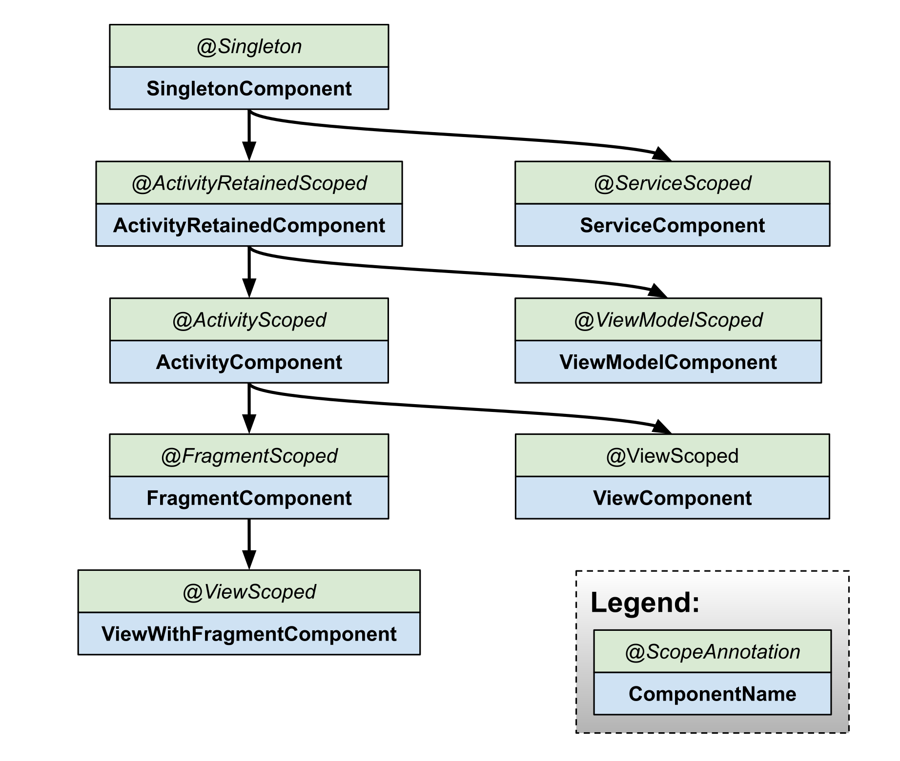

# Dependency Injection(의존성 주입)
의존성 주입(Dependency Injection, DI)은 객체 생성과 의존성 관리를 외부에서 처리하여 코드의 재사용성을 높이고, 객체 간 결합도를 낮춰 유지보수와 테스트 용이성을 높이는 구조를 제공한다.<br/>
<br/>
<br/>

# Hilt

Hilt 는 Google 이 Dagger 를 기반으로 만든 안드로이드에 특화된 DI(Dependency Injection) 라이브러리이다.<br/>
안드로이드의 각 컴포넌트(ViewModel, Activity, Fragment 등)에 맞춰 자동으로 필요한 코드를 생성한다.<br/>
또한, Koin 과 달리 컴파일 시점에 의존성을 확인하여 런타임 에러를 방지할 수 있다.<br/>
<br/>
<br/>

## Hilt Components
Hilt 는 계층 구조를 가진 컴포넌트를 통해 필요한 의존성을 클래스에 제공한다.<br/>
각 컴포넌트는 부모 컴포넌트로부터 의존성을 상속받아 사용할 수 있으며, 다양한 생명주기에 맞춰 구성된다.<br/>
컴포넌트 생성은 `@HiltAndroidApp` 어노테이션이 적용된 애플리케이션 클래스에서 시작된다.<br/>

<br/>

### SingletonComponent
애플리케이션 전체에서 공유되는 의존성을 관리한다.<br/>
<br/>

### ActivityComponent
특정 액티비티에서만 유효한 의존성을 관리한다.<br/>
<br/>

### FragmentComponent
특정 프래그먼트에서만 유효한 의존성을 관리한다.<br/>
<br/>

### ViewModelComponent
ViewModel에 필요한 의존성을 관리한다.<br/>
<br/>

### ServiceComponent
특정 서비스에서만 유효한 의존성을 관리한다.<br/>
<br/>

### ViewComponent
특정 View에서만 유효한 의존성을 관리한다.<br/>
<br/>
<br/>

## Setup
```toml
# /gradle/libs.versions.toml
# Warning: kotlin 버전과 ksp 버전이 싱크가 맞지 않으면 hilt 사용 시 에러 발생
[versions]
ksp = "2.0.0-1.0.21"
dagger-hilt = "2.52"

[plugins]
ksp = { id = "com.google.devtools.ksp", version.ref = "ksp" }
dagger-hilt = { id = "com.google.dagger.hilt.android", version.ref = "dagger-hilt" }

[libraries]
dagger-hilt-android = { group = "com.google.dagger", name = "hilt-android", version.ref = "dagger-hilt" }
dagger-hilt-compiler = { group = "com.google.dagger", name = "hilt-android-compiler", version.ref = "dagger-hilt" }
dagger-hilt-testing = { group = "com.google.dagger", name = "hilt-android-testing", version.ref = "dagger-hilt" }
```
```groovy
// 최상위 build.gradle.kts
plugins {
    alias(libs.plugins.ksp) apply false
    alias(libs.plugins.dagger.hilt) apply false
}
```
```groovy
// 모듈 단 build.gradle.kts
plugins {
    alias(libs.plugins.ksp)
    alias(libs.plugins.dagger.hilt)
}
dependencies {
    implementation(libs.dagger.hilt.android)
    ksp(libs.dagger.hilt.compiler)
    kspTest(libs.dagger.hilt.compiler)
    testImplementation(libs.dagger.hilt.testing)
}
```
<br/>
<br/>

## Hilt 어노테이션
### @HiltAndroidApp
애플리케이션 클래스에 추가하여 Hilt 를 초기화하고 의존성 주입 환경을 설정한다.<br/>

```kotlin
@HiltAndroidApp
class App : Application() {
    override fun onCreate() {
        super.onCreate()
    }
}
```
<br/>

### @AndroidEntryPoint / @Inject
`@AndroidEntryPoint` 어노테이션을 사용하여 해당 클래스가 Hilt 컴포넌트로부터 의존성을 주입받을 수 있도록 설정한다.<br/>
`@Inject` 어노테이션을 사용하여 클래스의 생성자나 필드에 적용하여 Hilt가 객체를 생성하거나 의존성을 주입할 수 있도록 설정한다.<br/>

```kotlin
@AndroidEntryPoint
class MainActivity : AppCompatActivity() {
    private val viewModel: MainViewModel by viewModels()

    @Inject
    lateinit var doTestClass: DoTestClass // 필드 주입(Field Injection)

    override fun onCreate(savedInstanceState: Bundle?) {
        super.onCreate(savedInstanceState)
        enableEdgeToEdge()
        setContentView(R.layout.activity_main)
        ViewCompat.setOnApplyWindowInsetsListener(findViewById(R.id.main)) { v, insets ->
            val systemBars = insets.getInsets(WindowInsetsCompat.Type.systemBars())
            v.setPadding(systemBars.left, systemBars.top, systemBars.right, systemBars.bottom)
            insets
        }
    }
}
```
<br/>

### @InstallIn
모듈이 설치될 Hilt 컴포넌트를 지정하며, 컴포넌트의 생명주기와 의존성 범위를 결정한다.<br/>

```kotlin
@Module
@InstallIn(SingletonComponent::class)
class TestModule {
    @Singleton
    @Provides
    fun provideTest(
        // Context 중에서 Application 범위의 Context 를 명확히 지정하여 Hilt 를 통해 주입받을 수 있음
        @ApplicationContext context: Context
    ): TestClass = TestClass()
}
```
<br/>

### @Provides
Hilt 가 자동으로 생성할 수 없는 객체(외부 라이브러리, Builder 패턴 등)에 대해 의존성을 제공하는 데 사용된다.<br/>

```kotlin
@Module
@InstallIn(SingletonComponent::class)
class NetworkModule {
    @Singleton
    @Provides
    fun provideJson(): Json = Json {
        prettyPrint = true
        ignoreUnknownKeys = true
    }

    @Singleton
    @Provides
    fun provideHttpClient(): OkHttpClient {
        return OkHttpClient.Builder().build()
    }

    @Singleton
    @Provides
    fun provideRetrofit(
        json: Json,
        okHttpClient: OkHttpClient
    ): Retrofit = Retrofit.Builder()
        .baseUrl("https://example.com ")
        .client(okHttpClient)
        .build()
}
```
<br/>

### @Binds
인터페이스 타입의 의존성을 제공하기 위해 추상 메서드에 적용되며, 반환형은 인터페이스 타입, 파라미터는 구현체 타입으로 설정해야 한다.<br/>

```kotlin
interface UserRepository {
    fun getName(): String
}

class UserRepositoryImpl @Inject constructor() : UserRepository {
    override fun getName(): String = "홍길동"
}
```
```kotlin
@Module
@InstallIn(SingletonComponent::class)
abstract class RepoModule {
    @Binds
    @Singleton
    abstract fun bindUserRepository(impl: UserRepositoryImpl): UserRepository
}
```
<br/>

### @Qualifier
Hilt에서 동일한 타입의 여러 의존성을 구별하기 위해 사용된다.<br/>

```kotlin
@Qualifier
@Retention(AnnotationRetention.BINARY)
annotation class DefaultCoroutineScope

@Qualifier
@Retention(AnnotationRetention.BINARY)
annotation class MainCoroutineScope

@Qualifier
@Retention(AnnotationRetention.BINARY)
annotation class IoCoroutineScope
```
```kotlin
@Module
@InstallIn(SingletonComponent::class)
class CoroutineScopeModule {
    @DefaultCoroutineScope
    @Singleton
    @Provides
    fun provideDefaultCoroutineScope(): CoroutineScope = CoroutineScope(
        context = SupervisorJob() + Dispatchers.Default
    )

    @MainCoroutineScope
    @Singleton
    @Provides
    fun provideMainCoroutineScope(): CoroutineScope = CoroutineScope(
        context = SupervisorJob() + Dispatchers.Main
    )

    @IoCoroutineScope
    @Singleton
    @Provides
    fun provideIoCoroutineScope(): CoroutineScope = CoroutineScope(
        context = SupervisorJob() + Dispatchers.IO
    )
}
```
<br/>

### @HiltViewModel
ViewModel 에서 Hilt를 통해 의존성을 주입할 수 있도록 설정하며, `SavedStateHandle` 을 포함한 상태 관리를 지원한다.<br/>

```kotlin
@HiltViewModel
class MainViewModel @Inject constructor(
    private val userRepository: UserRepository,
    savedStateHandle: SavedStateHandle
) : ViewModel()
```