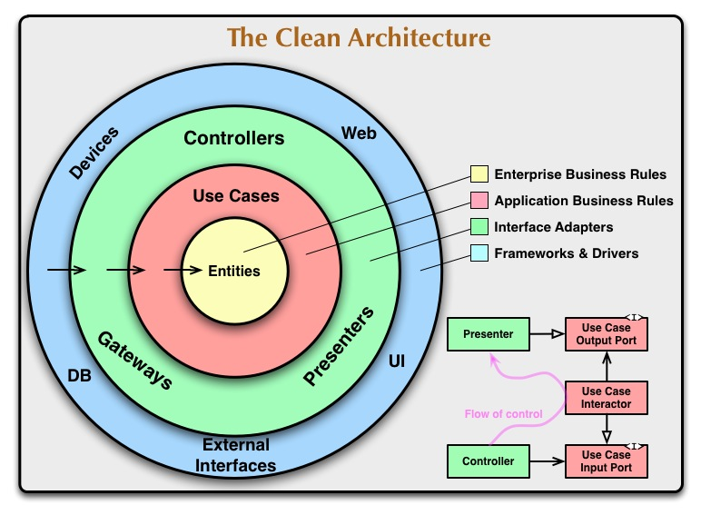
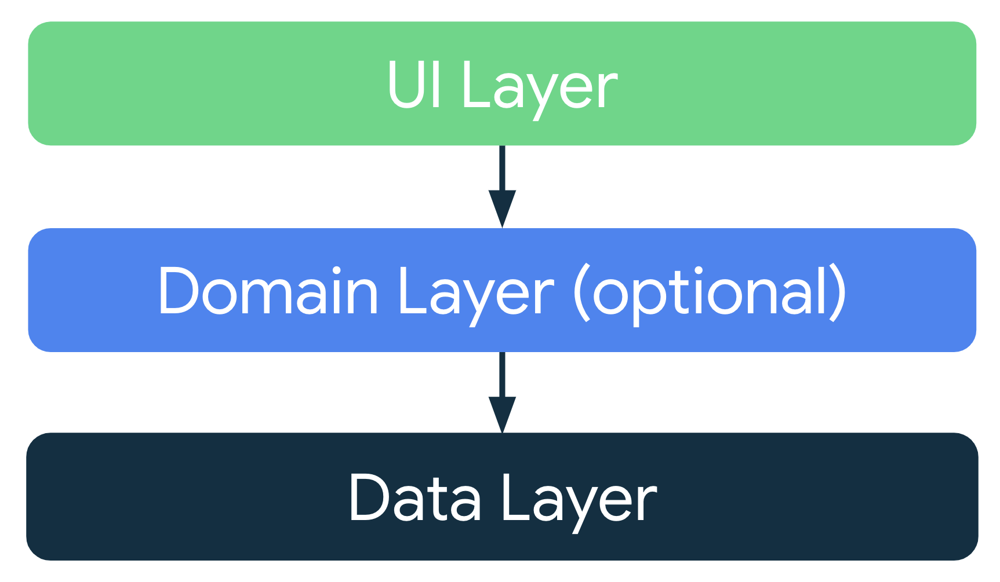
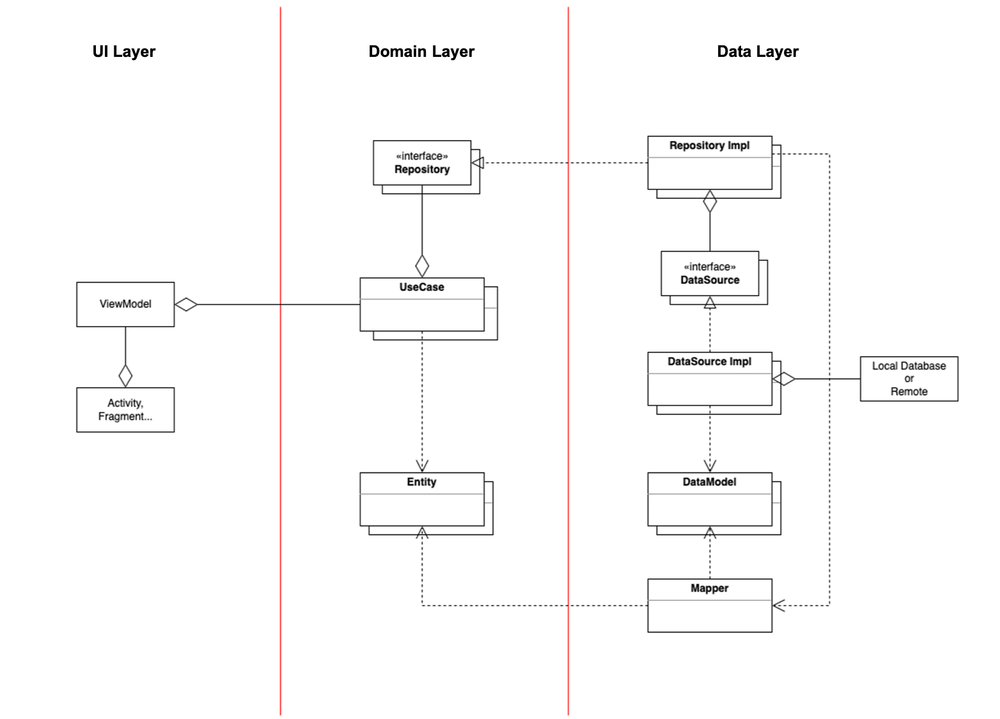

# Clean Architecture
- - -
Clean Architecture 는 로버트 C. 마틴(Robert C. Martin)이 제안한 아키텍처 패턴으로, 소프트웨어를 독립적인 계층으로 나누고 각 계층이 특정 역할을 수행하도록 설계된다.
즉, 클린 아키텍처(Clean Architecture)는 유지보수성, 확장성, 테스트 용이성을 극대화하기 위해 설계된 아키텍처 패턴이다.
가장 중요한 개념은 의존성 규칙을 명확히해서 비즈니스 로직이 UI, 프레임워크, 데이터베이스 같은 외부 요소에 의존하지 않도록 설계하는 것이 핵심이다.
예를 들어, 비즈니스 로직을 담당하는 ViewModel 은 데이터 원본(DB, API 등)에 의존하지 않고, 인터페이스와 UseCase 를 통해 상호작용해야 한다.

<br/>
<br/>

## 계층 설명
### Entity
애플리케이션의 핵심 비즈니스 규칙이 정의된 계층이다.<br/>
<br/>

### Use Case
특정 비즈니스 로직을 실행하는 계층이다.<br/>
<br/>

### Presentation
UI 와 관련된 코드가 위치하며 사용자와의 상호작용을 관리한다.<br/>
<br/>

### Data
로컬 DB 나 API 와의 통신을 담당하는 계층이다.<br/>
<br/>
<br/>

## SOLID 원칙
### 단일 책임 원칙(Single Responsibility Principle)
클래스는 단 하나의 책임만을 가져야 하며, 한 기능만을 수행하도록 설계해야 한다.<br/>
이를 통해 코드 변경 시 영향 범위를 최소화하고, 유지보수성을 높일 수 있다.<br/>
<br/>

### 개방-폐쇄 원칙(Open-Closed Principle)
클래스는 확장에는 열려 있고 수정에는 닫혀 있어야 한다.<br/>
기능 추가 시 새로운 클래스를 작성하고, 기존 클래스의 변경을 최소화하도록 설계한다.<br/>
<br/>

### 리스코프 치환 원칙(Liskov Substitution Principle)
자식 클래스는 부모 클래스의 기능을 대체할 수 있어야 한다.<br/>
다형성을 유지하며, 상속 시 부모 클래스의 규칙을 지키도록 구성해야 한다.<br/>
<br/>

### 인터페이스 분리 원칙(Interface Segregation Principle)
용도에 맞게 인터페이스를 잘게 분리하여, 클라이언트가 필요하지 않은 기능에 의존하지 않도록 설계해야 한다.<br/>
<br/>

### 의존성 역전 원칙(Dependency Inversion Principle)
구현 클래스가 아닌 인터페이스에 의존하도록 설계하여 모듈 간의 결합도를 낮춰야 한다.<br/>
<br/>
<br/>
<br/>


# 안드로이드 권장 아키텍처(Recommended Architecture)
- - -
안드로이드의 권장 아키텍처는 MVVM 패턴을 기반으로 하며, Google 에서 공식으로 제공하는 개발 가이드이다.<br/>
UI 와 비즈니스 로직을 분리하여 개발 효율성을 높이고, 전체 앱 아키텍처를 고려해 크게 Data, Domain, UI 레이어로 구성된다.<br/>
클린 아키텍처와 유사하나 Domain 레이어가 필수는 아니며 필요에 따라 유연하게 추가할 수 있다.<br/>


<br/>
<br/>

## UI Layer
UI Layer 는 사용자 인터페이스(UI)와 직접 상호작용하는 계층이다.<br/>
사용자 입력을 받아 이를 Intent 또는 Event 로 변환하고, UseCase 를 호출하여 결과를 UI 에 반영한다.<br/>


```kotlin
@HiltViewModel
class PhotoGridViewModel @Inject constructor(
    savedStateHandle: SavedStateHandle,
    getPhotosUseCase: GetPhotosUseCase
) : BaseViewModel<PhotoGridState, PhotoGridSideEffect>(
    initialState = PhotoGridState(),
    savedStateHandle = savedStateHandle
) {
    val photos = getPhotosUseCase().cachedIn(viewModelScope)
}
```
```kotlin
@HiltViewModel
class PhotoDetailViewModel @Inject constructor(
    private val savedStateHandle: SavedStateHandle,
    private val getPhotoUseCase: GetPhotoUseCase
) : BaseViewModel<PhotoDetailState, PhotoDetailSideEffect>(
    initialState = PhotoDetailState(),
    savedStateHandle = savedStateHandle
) {
    init {
        fetchGetPhoto()
    }

    private fun fetchGetPhoto() = getPhotoUseCase(
        id = savedStateHandle.getStateFlow(NavigatorConstant.KEY_ID, "").value
    ).onSuccess {
        updateState {
            copy(
                uiState = UiState.Success,
                photo = it
            )
        }
    }.fetchLoad()
}
```
<br/>
<br/>

## Domain Layer
Domain Layer 는 애플리케이션의 비즈니스 로직을 담당하는 계층이다.<br/>
UI Layer 와 Data Layer 의 중간에서 데이터 처리와 비즈니스 규칙을 정의한다.<br/>
외부 서비스 의존성이 없는 순수한 Kotlin 클래스로 구성되어 외부 프레임워크나 안드로이드 SDK 에 의존하지 않기 때문에 테스트하기 쉬운 구조이다.<br/>

```kotlin
// UseCase 는 주로 비즈니스 로직을 캡슐화하며, 클래스 네이밍은 동사 + 대상 + UseCase 형태를 권장한다.
// operator fun invoke() 를 사용하여 함수처럼 호출할 수 있다.
class SetAccessTokenUseCase @Inject constructor(
    private val userRepository: UserRepository
) {
    suspend operator fun invoke(
        accessToken: String
    ) = userRepository.setAccessToken(
        accessToken = accessToken
    )
}
```
```kotlin
class GetPhotosUseCase @Inject constructor(
    private val repository: PhotoRepository
) {
    operator fun invoke(): Flow<PagingData<PhotoModel>> = repository.getPhotos()
}
```
```kotlin
class GetPhotoUseCase @Inject constructor(
    private val repository: PhotoRepository
) {
    operator fun invoke(
        id: String
    ): Flow<ApiResult<PhotoModel>> = flow {
        emit(repository.getPhoto(id))
    }
}
```
<br/>
<br/>

## Data Layer
Data Layer 는 데이터 소스와의 상호작용을 관리하는 계층이다.<br/>
Domain Layer 의 요청을 받아 데이터를 가져오고 가공한 후 전달하며, Mapper 를 통해 데이터를 변환하여 UI Layer 가 Data Layer 에 의존하지 않도록 해야한다.<br/>
외부 서비스의 의존성을 포함하되, Repository 패턴을 활용하여 Domain 계층에는 인터페이스로 추상화한다.<br/>


```kotlin
class RemotePhotoDataSourceImpl @Inject constructor(
    private val api: PhotoApi
): RemotePhotoDataSource {

    override fun getPhotos(): Flow<PagingData<PhotoResponse>> = Pager(
        PagingConfig(
            initialLoadSize = 20,
            pageSize = 20,
            prefetchDistance = 2
        )
    ) {
        RemotePhotoPagingSource(api)
    }.flow

    override suspend fun getPhoto(
        id: String
    ): ApiCallback<PhotoResponse> = api.getPhoto(id)
}
```
```kotlin
class PhotoRepositoryImpl @Inject constructor(
    private val remoteDataSource: RemotePhotoDataSource
): PhotoRepository {
    override fun getPhotos(): Flow<PagingData<PhotoModel>> {
        val data = remoteDataSource.getPhotos().map {
            it.map { response ->
                response.toModel()
            }
        }

        return data
    }

    override suspend fun getPhoto(
        id: String
    ): ApiResult<PhotoModel> = remoteDataSource.getPhoto(id).callback {
        it.toModel()
    }
}
```
<br/>
<br/>
<br/>


# 주의사항
- - -
## 클린 아키텍처 적합성
클린 아키텍처는 복잡한 비즈니스 로직이나 대규모 프로젝트에서 유지보수성과 확장성을 높이는 데 효과적이다.<br/>
하지만 작은 규모의 앱이나 MVP 단계에서는 오히려 개발 속도를 저하시킬 수 있고, 불필요한 복잡성을 초래할 수 있다.<br/>
따라서 프로젝트의 복잡도, 팀 규모, 장기적인 유지보수 계획을 고려하여 적용 범위를 결정하는 것이 중요하다.<br/>
<br/>
<br/>

## 클린 아키텍처 적용 예시
클린 아키텍처를 적용할 때 비동기 처리와 라이프사이클 관리, 그리고 의존성 관리가 어려움의 요소이다.<br/>
먼저 계층 간 의존성 주입을 위해 Hilt 와 같은 DI 라이브러리를 사용하는 것이 권장된다.<br/>
ViewModel 에서는 `StateFlow` 로 UI 상태를 관리하고, Use Case 에서는 `suspend` 함수를 사용하여 명확한 책임 분리를 유지해야 한다.<br/>
Use Case 에서 비동기 작업을 수행할 때, 코루틴(`Coroutine`)과 ``Flow` 를 활용하여 UI 와 비즈니스 로직 간의 비동기 처리를 효과적으로 관리해야 한다.<br/>
이를 통해 Use Case 와 Repository 간의 의존성을 주입하고, 테스트 환경에서는 Fake 객체로 쉽게 대체할 수 있는 구조를 만들어야 한다.<br/>
Use Case 와 Repository 는 Unit Test 로 검증하고, ViewModel 은 Robolectric 을 활용하여 실제 안드로이드 환경에서 테스트할 수 있다.<br/>
이렇게 하면 각 계층의 테스트가 독립적이면서도 신뢰성을 확보할 수 있었습니다.<br/>
<br/>
<br/>

## 클린 아키텍처 적용 시 성능 이슈
클린 아키텍처를 적용하면 계층이 많아지면서 불필요한 데이터 변환(Mapper 남용)이나 과도한 DI(의존성 주입)로 인한 성능 저하가 발생할 수 있다.<br/>
단순한 데이터 변환에는 별도의 Mapper 클래스를 두기보다는 Extension Function 으로 대체하여 오버헤드를 줄일 수 있다.<br/>
Hilt 의 Singleton Scope 를 적극 활용하고, 자주 사용되는 객체는 `Lazy` 주입으로 불필요한 초기화를 방지할 수 있다.<br/>
단순한 로직에는 Use Case 를 생략하고 ViewModel 에서 Repository 를 직접 호출하는 등, 상황에 따라 유연하게 계층 구조를 조정해야 한다.<br/>