# Compose
- - -
## 안드로이드 XML
안드로이드의 기존 뷰 시스템(View)은 XML 로 UI 를 구성하며, UI 요소에 접근하고 업데이트하려면 `findViewById()` 함수를 사용하거나 `ViewBinding` 을 통해 뷰 객체를 가져와야 한다.<br/>
각 뷰는 고유의 상태를 가지며, 예를 들어 `getText()` 함수로 텍스트 상태를 가져오고, `setText()` 함수로 상태를 업데이트한다.<br/>
각 뷰 컴포넌트마다 개별 상태를 관리해야 하기 때문에, 복잡한 UI 일수록 상태 관리가 어려워지는 문제가 발생한다.<br/>
이후 `DataBinding` 이 도입되어 XML 에서 직접 데이터와 UI 를 바인딩할 수 있게 되었으나, 여전히 모든 코드에 `DataBinding` 을 적용하기에는 한계가 있다.<br/>
<br/>
<br/>

## 명령형(imperative) vs 선언형(declarative)
### 명령형 방식
UI 구성의 각 단계를 상세히 지시해야 한다.<br/>
예를 들어, “파란색 버튼 A 를 생성하고, 그 자식으로 하얀 텍스트 B 를 추가한다. B 의 텍스트는 CLICK 이다.” 와 같은 방식이다.<br/>
<br/>

### 선언형 방식
원하는 UI 의 최종 상태를 선언하면, 프레임워크가 세부 구현을 처리해준다.<br/>
예를 들어, “버튼 A 는 파란색이며, CLICK 이라는 하얀 텍스트를 자식으로 갖는다.” 와 같은 방식이다.<br/>
선언형 방식에서는 UI 의 상태 관리와 렌더링을 프레임워크가 알아서 처리하므로, 복잡한 UI 를 다루기 더 용이하고 직관적이다.<br/>
<br/>
<br/>

## Jetpack Compose
Jetpack Compose 는 안드로이드를 위한 선언형 UI 툴킷으로, 2021년 7월 28일에 정식 출시되었다.<br/>
Compose 는 Jetpack 라이브러리와 통합되며, Material 디자인 컴포넌트와 테마를 기본 제공하여 복잡한 XML 없이도 UI 를 쉽게 이해하고 관리할 수 있다.<br/>
Compose 는 기존의 레거시 뷰(XML)와 상호작용이 가능하여, 기존 뷰를 Compose UI 에 포함하거나 반대로 Compose UI 를 기존 XML 레이아웃에 삽입할 수 있다.<br/>

```kotlin
class MainActivity : ComponentActivity() {
    override fun onCreate(savedInstanceState: Bundle?) {
        super.onCreate(savedInstanceState)
        enableEdgeToEdge()
        setContent {
            ComposeTheme {
                Scaffold(modifier = Modifier.fillMaxSize()) { innerPadding ->
                    Greeting(
                        name = "Android",
                        modifier = Modifier.padding(innerPadding)
                    )
                }
            }
        }
    }
}

@Composable
fun Greeting(name: String, modifier: Modifier = Modifier) {
    Text(
        text = "Hello $name!",
        modifier = modifier
    )
}

@Preview(showBackground = true)
@Composable
fun GreetingPreview() {
    ComposeTheme {
        Greeting("Android")
    }
}
```
<br/>
<br/>
<br/>


# Composition
- - -
컴포저블 함수는 화면을 그리기 위한 UI 의 기본 단위로, `@Composable` 어노테이션이 부여된 함수로 되어 있으며, 선언형 방식으로 UI 요소를 정의할 수 있다.<br/>
컴포지션(Composition)은 이러한 컴포저블 함수가 UI 를 구성하기 위해 컴포즈에서 처리하는 전체 과정을 의미한다.<br/>
최초 컴포지션이 발생할 때 UI 가 그려지며, 상태 변경이 발생하면 UI 의 일부만 업데이트될 수 있도록 컴포지션이 수정되는데, 이 과정을 리컴포지션(Recomposition)이라고 한다.<br/>

<br/>
<br/>

## Recomposition
리컴포지션(Recomposition)은 UI 의 상태(State)가 변경될 때 해당 상태와 연결된 컴포저블 함수가 다시 호출되어 UI 를 업데이트하는 과정을 말하며, 변경된 부분만 업데이트하기 때문에 성능 최적화에 유리하다.<br/>
리컴포지션이 발생하는 조건은 컴포저블이 동일한 상태를 읽고 있을 때이며, 이때 상태가 변하지 않았다면 리컴포지션은 스킵된다.<br/>
예를 들어, 두 인스턴스의 equals 결과가 항상 같을 때나, 상태 객체 내부의 프로퍼티가 안정적일 때는 스킵된다.<br/>
컴포즈에서는 기본 자료형, 문자열, 함수 타입 등이 안정적인 것으로 간주되며, 그렇지 않은 경우에는 `@Stable` 어노테이션을 사용해 안정성을 명시할 수 있다.<br/>

```kotlin
@Stable
interface UiState<T : Result<T>> {
    val value: T?
    val exception: Throwable?

    val hasError: Boolean
        get() = exception != null
}
```
<br/>
<br/>

## 여러 Composition 호출
컴포즈에서 동일한 컴포저블 함수가 여러 번 호출되면, 각 호출은 독립적인 인스턴스로 구성된다.<br/>
각 인스턴스는 독립적인 생명주기를 가지므로, 상태에 따라 다른 UI 요소가 독립적으로 관리될 수 있다.<br/>
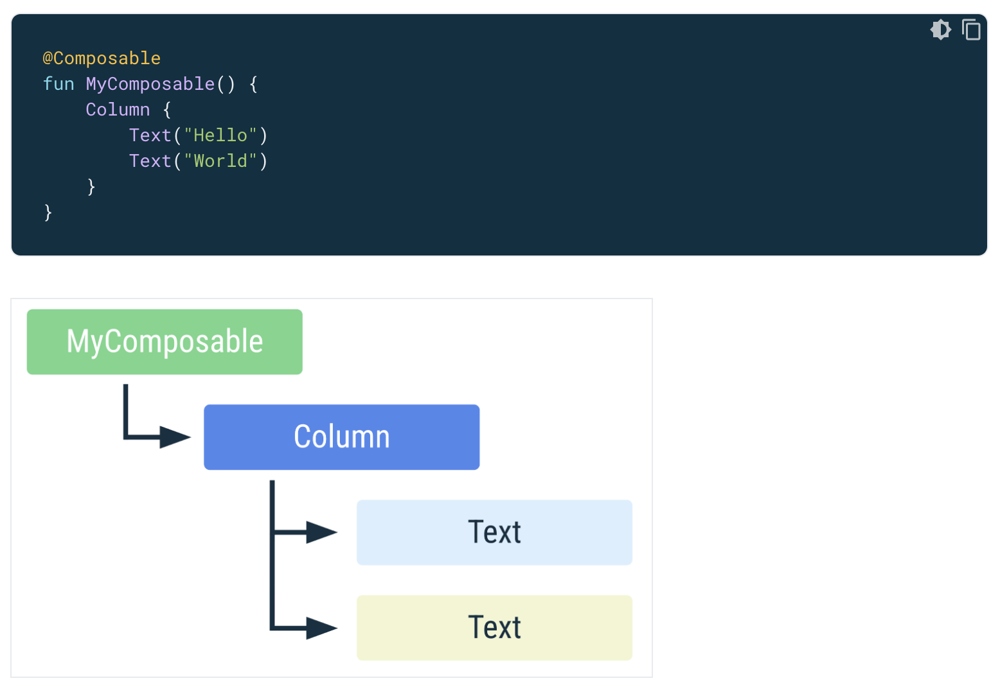
<br/>
<br/>

## 상태에 따라 컴포저블 호출이 달라지는 경우
컴포즈는 코드 상에서 어떤 위치에 있냐에 따라 인스턴스를 구분한다.<br/>
어떤 컴포저블이 추가 혹은 제거되는지 알고 있기 때문에 리컴포지션이 일어났을 때 모든 것을 전부 갱신하지 않고 입력값이 변경된 컴포저블 일부만 갱신한다.<br/>
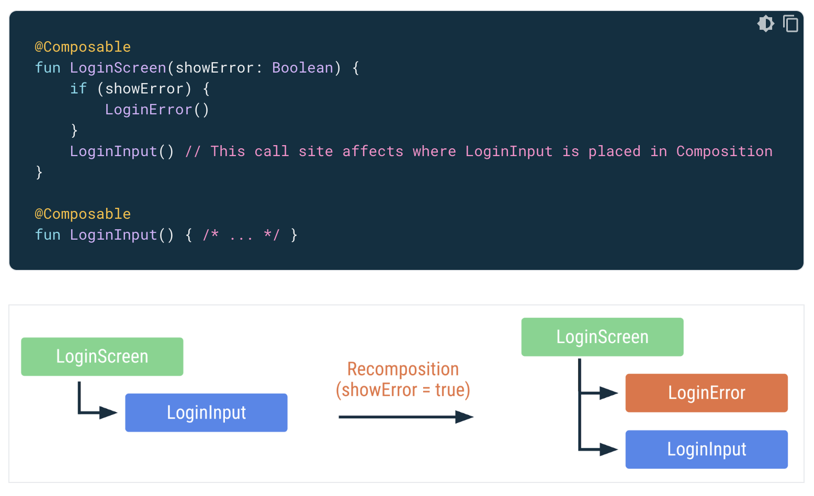
<br/>
<br/>

## Smart Recomposition
스마트 리컴포지션(Smart Recomposition)은 상태 변화에 따라 필요한 부분만 다시 그려주는 최적화된 리컴포지션이다.<br/>
<br/>

### Good
여러 컴포저블이 배치된 상태에서 새로운 컴포저블이 추가될 경우, 기존 컴포저블이 다시 그려지지 않도록 재사용된다.<br/>
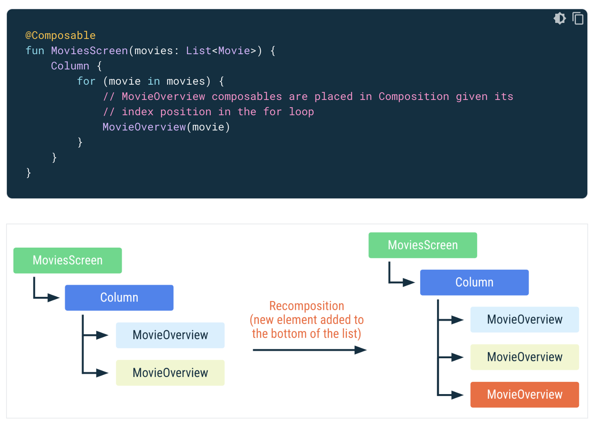
<br/>

### Bad
컴포저블이 목록의 상단에 추가되어 기존 컴포저블의 순서가 변경된다면, 컴포지션은 모든 컴포저블을 새로 그리게 된다.<br/>
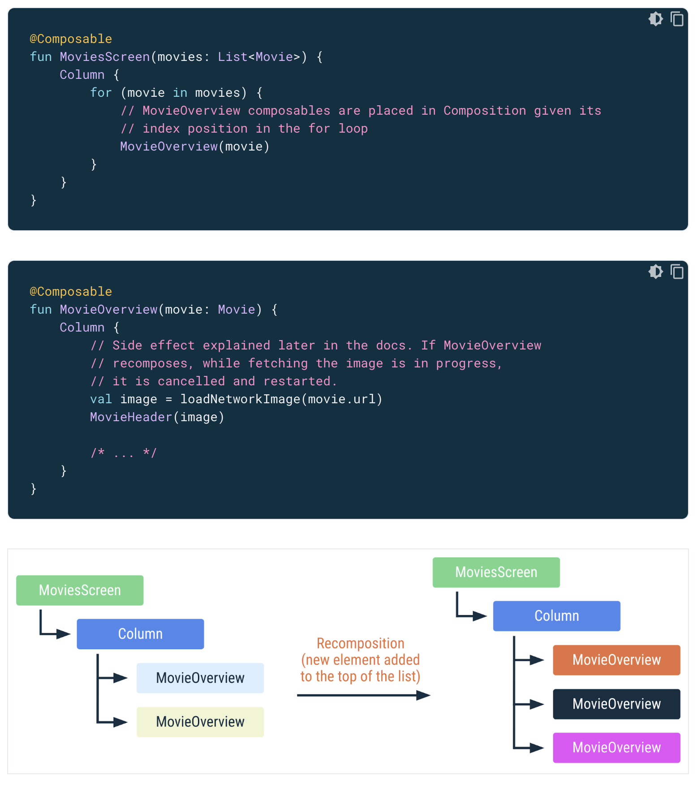
<br/>

### Used key()
`key()` 함수를 사용하여 컴포저블의 위치 변경을 최소화하고, 불필요한 리컴포지션을 줄일 수 있다.<br/>
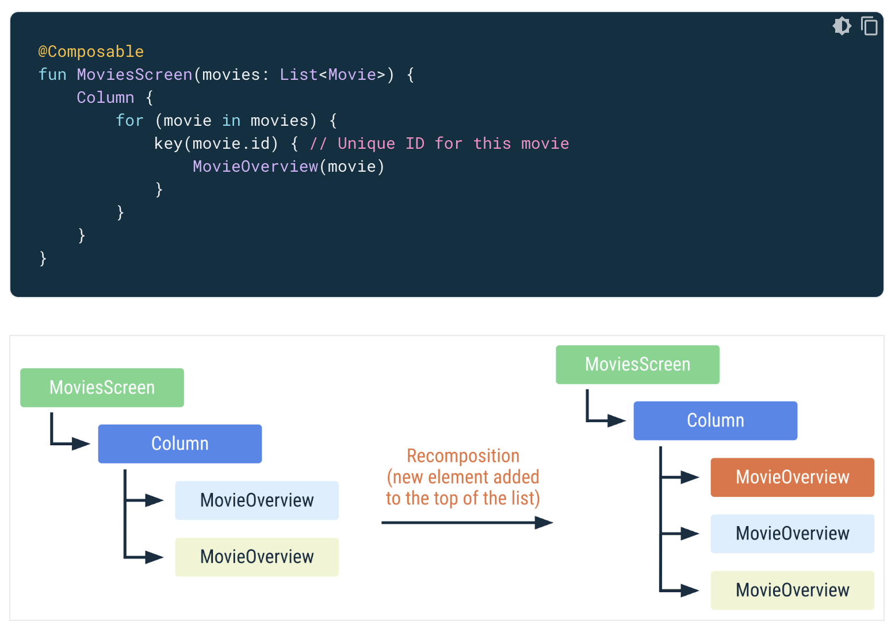
<br/>
<br/>
<br/>


# Compose Rendering
- - -
## Compose Rendering Process
안드로이드 컴포즈에서 UI 를 그리기 위해서는 Composition, Layout, Drawing 이라는 세 단계를 거친다.<br/>
각 단계는 UI 를 구성하고 렌더링하는 데 중요한 역할을 하며, 최적화된 UI 업데이트를 가능하게 한다.<br/>
상태가 변경될 때마다 필요한 단계에서 UI 를 재구성하여 효율성을 극대화한다.<br/>
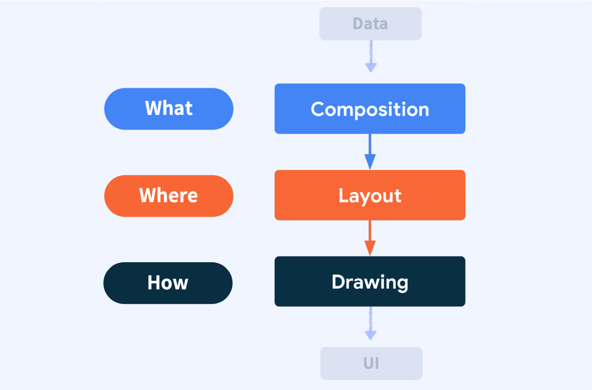
<br/>
<br/>

## Composition
Composition 단계는 무엇을 보여줄지(What)를 결정하는 단계로, 작성된 컴포저블 함수를 트리 형태의 UI 트리로 변환한다.<br/>
각 컴포저블 함수는 UI 트리에서 노드로 표현되며, 이를 레이아웃 노드라고 부른다.<br/>
컴포저블 함수는 자식 컴포저블이나 상태, 로직 등을 포함할 수 있으며, 이러한 정보가 트리에 적절하게 배치되어 다음 단계로 전달된다.<br/>
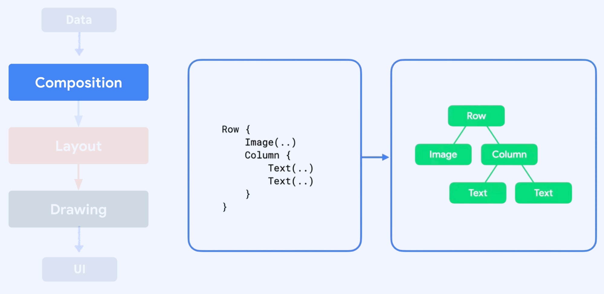
<br/>
<br/>

## Layout
Layout 단계는 어디에 보여줄지(Where)를 결정하는 단계로, UI 트리를 탐색하며 각 레이아웃 노드를 화면의 특정 위치에 배치한다.<br/>
먼저 자식이 있는 경우 자식 컴포저블을 먼저 측정하며, 그 다음 자식 노드를 기준으로 자신의 크기를 측정하고, 마지막으로 자식 노드의 위치를 상대적 위치로 설정하여 배치한다.<br/>
이 과정이 끝나면 모든 레이아웃 노드는 위치(x, y 좌표)와 크기(너비, 높이) 정보를 갖게 된다.<br/>
컴포즈의 Layout 단계는 트리를 한 번만 방문하기 때문에 중첩된 구조에서도 효율적이다.<br/>
기존의 XML 기반 뷰 시스템에서는 중첩이 많아질수록 성능이 저하되지만, 컴포즈에서는 단일 탐색을 통해 성능적 장점이 있다.<br/>
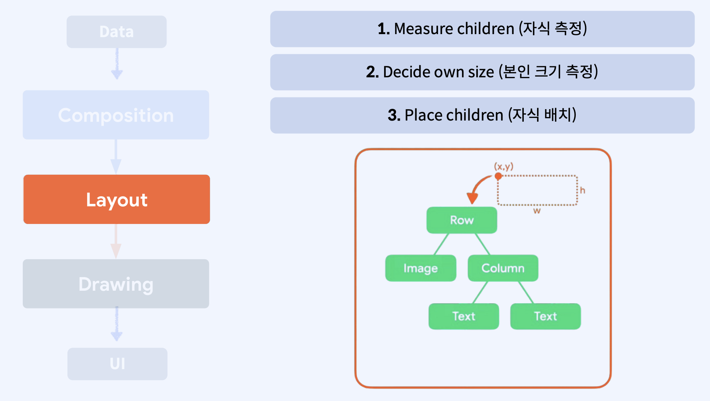
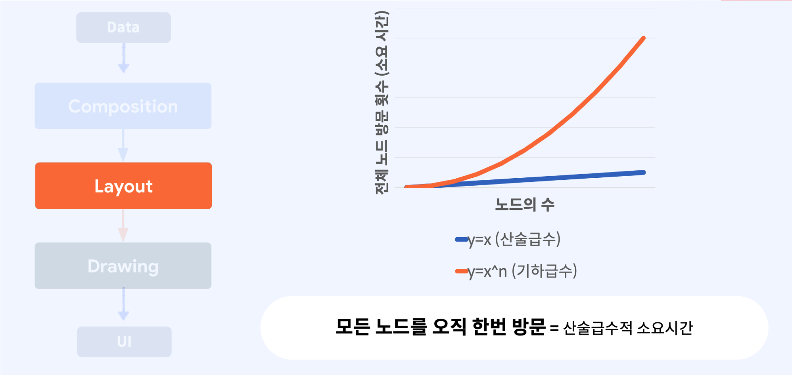
<br/>
<br/>

## Drawing
Drawing 단계는 어떻게 그릴지(How)를 결정하는 단계로, Layout 단계에서 계산된 위치 정보를 기반으로 각 요소를 화면에 그린다.<br/>
컴포즈는 트리를 다시 한 번 방문하여 순서대로 각 요소를 그려 화면에 최종적으로 표시한다.<br/>
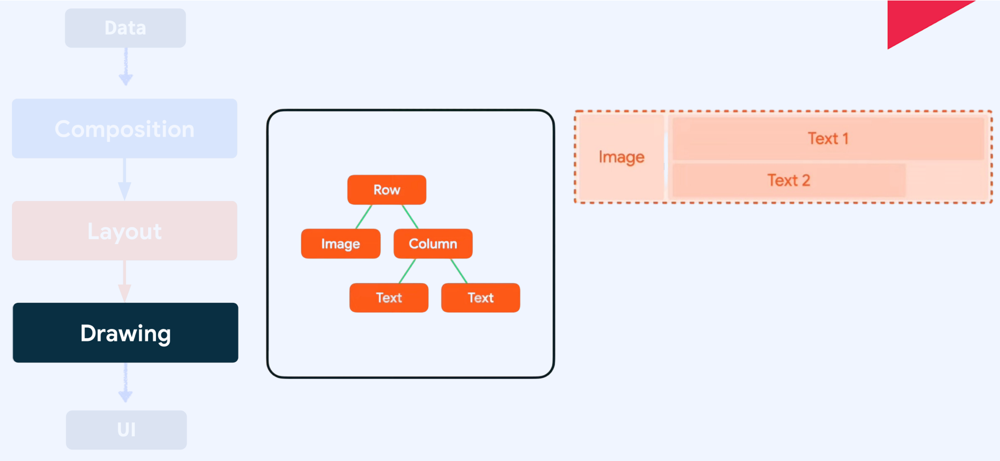
<br/>
<br/>

## Modifier
컴포저블 함수에 `Modifier` 가 설정된 경우, UI 트리에 래퍼 노드가 생성되며, 이 래퍼 노드는 레이아웃 노드를 감싸며, `Modifier` 들이 체인으로 연결될 수 있다.<br/>
Layout 단계에서 각 레이아웃 노드가 방문될 때 래퍼 노드의 위치 및 크기 정보가 반영되며, 원본 레이아웃 노드 대신 래퍼 노드의 값을 참조하여 레이아웃을 설정한다.<br/>
이를 통해 위치와 크기 정보를 오버라이드할 수 있다.<br/>
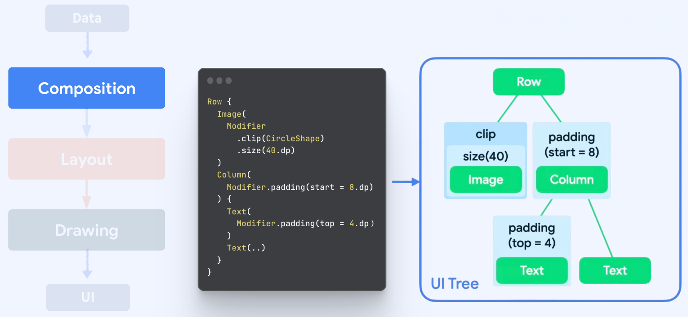