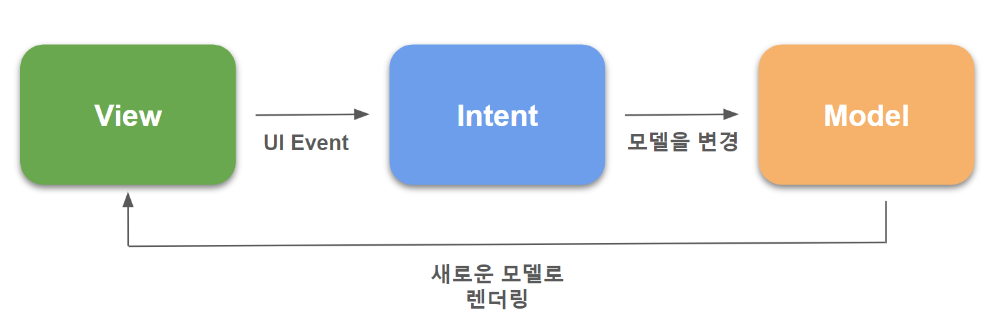
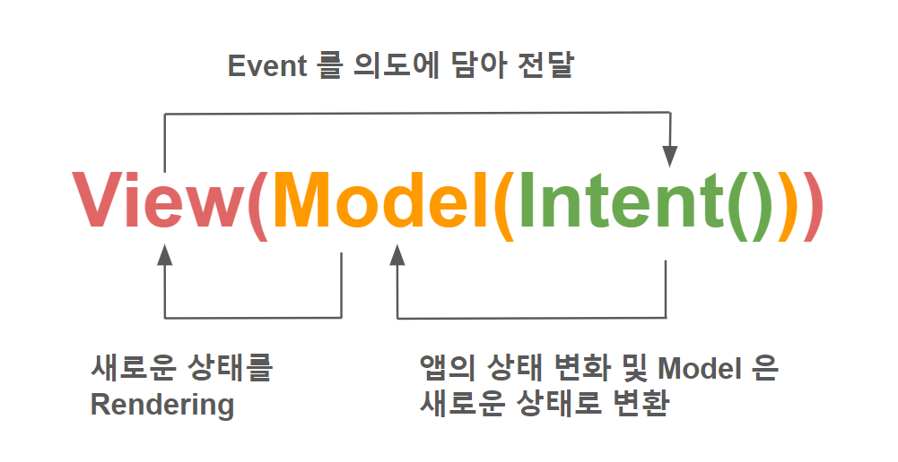
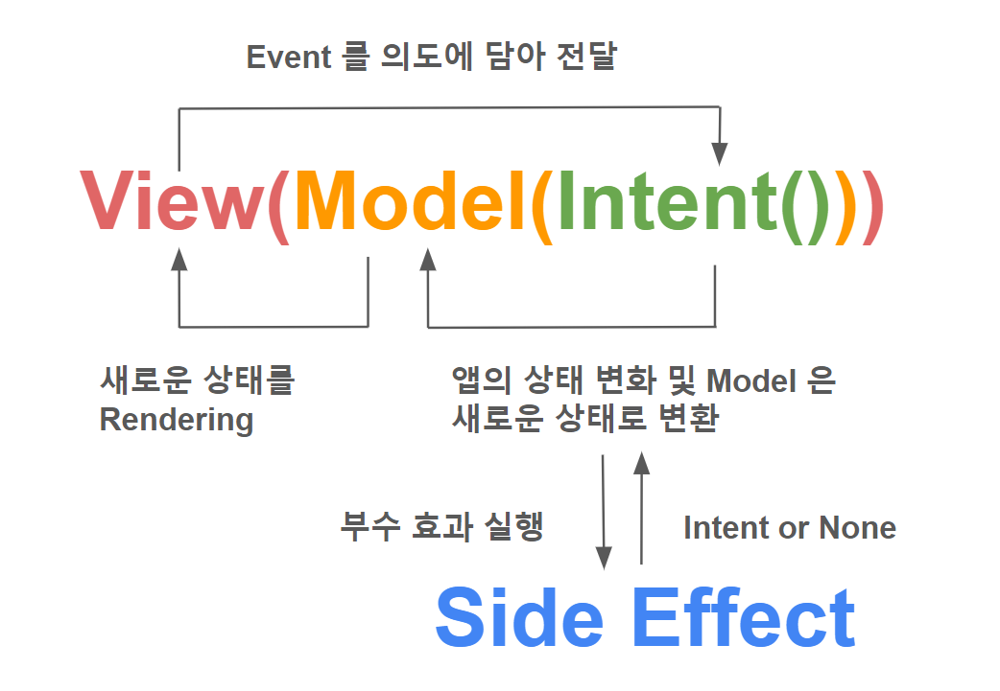

# MVI(Model-View-Intent)
- - -
MVI 패턴은 Model, View, Intent 로 구성된다.<br/>
사용자의 액션은 Intent 로 정의되고, Intent 가 ViewModel 로 전달되어 비즈니스 로직(Model)을 처리한 후, 그 결과로 새로운 State 를 생성해서 Reducer 를 통해 View 에 렌더링하는 구조이다.<br/>
가장 큰 특징은 상태의 불변성(Immutable State)과 단방향 흐름으로, 상태(State)는 항상 한 방향으로만 흐르기 때문에, 데이터 흐름이 명확하고 디버깅이 쉽다.<br/>
따라서 복잡한 UI 나 다양한 상태를 관리해야 할 때 특히 유용하다.<br/>

<br/>
<br/>

## 역할
### Model
UI 상태를 나타내는 불변 데이터 객체로, Intent 와 이를 처리하는 Reducer 를 통해 새로운 상태로 갱신된다.<br/>
<br/>

### View
화면에 표시되는 UI 로, Model 의 변경 사항에 의해 자동으로 갱신된다.<br/>
<br/>

### Intent
사용자 액션이나 이벤트를 추상화한 객체로, 상태 변화를 트리거하며, Reducer 를 통해 새로운 Model 을 생성하는 입력 값으로 사용된다.<br/>
<br/>
<br/>

## 순수 사이클(Pure Cycle)
MVI 는 단방향 데이터 흐름을 기반으로 동작하며, 상태(State) 갱신 로직에서 순수 함수(Reducer)를 사용한다.<br/>
순수 함수는 동일한 입력에 대해 항상 동일한 출력을 반환하는 함수로, 상태 변화를 예측 가능하게 한다.<br/>
Intent 는 사용자의 행동(입력) 또는 이벤트를 나타내는 객체로, 상태(State)를 갱신하기 위한 트리거 역할을 한다.<br/>
Intent 와 State 는 서로 다른 개념이며, Reducer 를 통해 Intent 를 처리한 결과로 새로운 State 가 생성된다.<br/>

<br/>
<br/>

## 부수 효과 사이클(Side Effect Cycle)
MVI 는 순수 함수 기반의 상태 관리(Pure Cycle)와 함께, 네트워크 요청이나 데이터베이스 작업 등 부수 효과(Side Effect)를 포함할 수 있다.<br/>
부수 효과는 외부 상태를 변경하거나 외부로부터 데이터를 가져오는 작업으로, 주로 Middleware 또는 별도의 Side Effect 처리기를 통해 관리된다.<br/>
이러한 구조를 통해 MVI 는 상태 관리의 예측 가능성과 안정성을 보장하면서도 외부와의 상호작용을 효과적으로 처리할 수 있다.<br/>

<br/>
<br/>

## Orbit MVI
Orbit 은 MVI 아키텍처를 쉽게 구현할 수 있도록 돕는 라이브러리로, 상태 관리와 부수 효과(Side Effect)를 효율적으로 처리할 수 있게 해준다.<br/>
Orbit 의 핵심은 `ContainerHost` 를 사용하여 상태를 관리하고, `Intent` 를 통해 상태를 변경하며, `SideEffect` 를 처리하는 것이다.<br/>
Orbit 을 사용하면 상태 관리가 간편해지고, 여러 기능을 추가하는 데 필요한 보일러 플레이트 코드 양을 줄일 수 있다.<br/>

### Setup
```toml
# gradle/libs.versions.toml
[versions]
orbit = "7.1.0"

[libraries]
orbit-compose = { group = "org.orbit-mvi", name = "orbit-compose", version.ref = "orbit"}
orbit-core = { group = "org.orbit-mvi", name = "orbit-core", version.ref = "orbit"}
orbit-test = { group = "org.orbit-mvi", name = "orbit-test", version.ref = "orbit"}
orbit-viewmodel = { group = "org.orbit-mvi", name = "orbit-viewmodel", version.ref = "orbit"}
```
```groovy
// 모듈 단 build.gradle.kts
dependencies {
    implementation(libs.orbit.core)
    implementation(libs.orbit.compose)
    implementation(libs.orbit.viewmodel)
    testImplementation(libs.orbit.test)
}
```
<br/>

### 예제 코드
```kotlin
// 상태를 담고 있는 Model(State)
data class HomeState(
    val num: Int = 0
)
```
```kotlin
// Side Effect 정의
sealed class HomeSideEffect {
    data class Toast(val text: String) : HomeSideEffect()
}
```
```kotlin
class HomeViewModel : ViewModel(), ContainerHost<HomeState, HomeSideEffect> {
    override val container = container<HomeState, HomeSideEffect>(HomeState())

    // add 함수를 intent 에 담고 연산 결과를 reduce 를 통해 새로운 state 로 생성
    fun add(num: Int) = intent {
        reduce {
            state.copy(
                num = state.num + num
            )
        }
        postSideEffect(HomeSideEffect.Toast("숫자: ${state.num}"))
    }
}
```
```kotlin
@Composable
fun HomeScreen(
    context: Context = LocalContext.current,
    viewModel: HomeViewModel
) {
    val state by viewModel.container.stateFlow.collectAsState()

    // Side Effect 실행
    viewModel.collectSideEffect {
        when (it) {
            is HomeSideEffect.Toast -> {
                Toast.makeText(context, it.text, Toast.LENGTH_SHORT).show()
            }
        }
    }

    Column {
        Button(
            onClick = { viewModel.add(1) }
        ) {
            Text("Add")
        }
        Text("숫자: ${state.num}")
    }
}
```