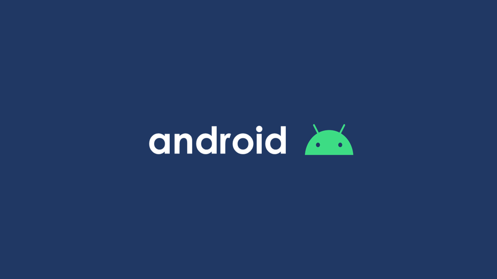

# BroadcastReceiver
- - -
`BroadcastReceiver` 는 시스템 또는 애플리케이션에서 발생하는 브로드캐스트 이벤트를 수신하고 처리하는 안드로이드 컴포넌트이다.<br/>
예를 들어, 배터리 부족, 네트워크 상태 변경, 기기 부팅 등의 이벤트를 감지할 수 있다.<br/>
<br/>
<br/>
<br/>


# BroadcastReceiver 의 등록 방법
- - - 
## 정적 등록(Static Registration)
정적 등록은 AndroidManifest.xml 에 receiver 요소를 추가하여 `BroadcastReceiver` 를 미리 정의하는 방식이다.<br/>
이 방법은 애플리케이션이 실행되지 않은 상태에서도 특정 시스템 이벤트를 수신할 수 있다.<br/>
그러나 Android 8.0(API 26) 이후 일부 이벤트는 정적 등록이 제한되었다.<br/>

```kotlin
class MyStaticBroadcastReceiver : BroadcastReceiver() {
    override fun onReceive(context: Context, intent: Intent) {
        when (intent.action) {
            Intent.ACTION_BOOT_COMPLETED -> {
                Log.d("MyStaticBroadcastReceiver", "Device boot completed!")
            }
        }
    }
}
```
<br/>
<br/>

## 동적 등록(Dynamic Registration)
동적 등록은 `Context.registerReceiver()` 메서드를 사용하여 런타임에 `BroadcastReceiver` 를 등록하는 방식이다.<br/>
애플리케이션이 실행 중일 때만 이벤트를 수신할 수 있으며, 더 많은 제어가 가능하다.<br/>

```kotlin
class MyDynamicBroadcastReceiver : BroadcastReceiver() {
    override fun onReceive(context: Context, intent: Intent) {
        when (intent.action) {
            Intent.ACTION_BATTERY_LOW -> {
                Log.d("MyDynamicBroadcastReceiver", "Battery is low!")
            }
        }
    }
}
```
```kotlin
val receiver = MyDynamicBroadcastReceiver()

// 동적 등록(예: 액티비티에서 등록)
fun exampleRegisterDynamicBroadcastReceiver(context: Context) {
    val filter = IntentFilter(Intent.ACTION_BATTERY_LOW)
    context.registerReceiver(receiver, filter)
}

// 동적 해제(필수)
fun exampleUnRegisterDynamicBroadcastReceiver(context: Context) {
    context.unregisterReceiver(receiver)
}
```
<br/>
<br/>
<br/>


# Local BroadcastReceiver
- - - 
글로벌 브로드캐스트는 불필요하게 다른 앱에도 전파될 수 있으므로, 애플리케이션 내부에서만 브로드캐스트를 사용해야 하는 경우 `LocalBroadcastManager` 를 이용하는 것이 권장된다.<br/>

```kotlin
class MyDynamicBroadcastReceiver : BroadcastReceiver() {
    override fun onReceive(context: Context, intent: Intent) {
        when (intent.action) {
            Intent.ACTION_BATTERY_LOW -> {
                Log.d("MyDynamicBroadcastReceiver", "Battery is low!")
            }
        }
    }
}
```
```kotlin
// 브로드캐스트 전송
fun exampleSendBroadcast(context: Context) {
    val intent = Intent("com.ymg.CUSTOM_ACTION").apply {
        putExtra("message", "Hello, Local Broadcast!")
    }
    LocalBroadcastManager.getInstance(context).sendBroadcast(intent)
}
```